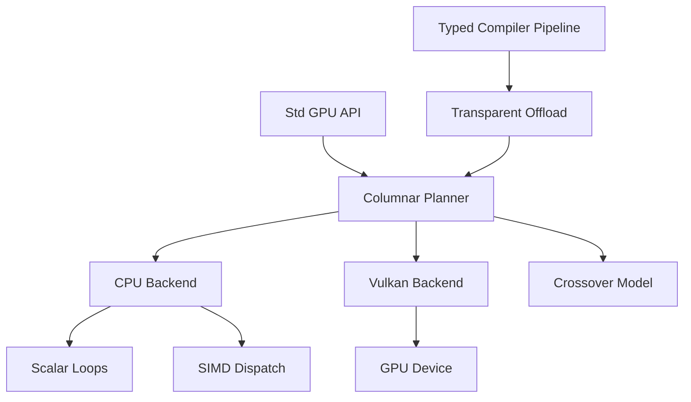

# Accelerated Columnar Execution

Yona's accelerator story starts as a columnar execution layer with multiple
backends. GPU execution is one backend; an optimized CPU backend is equally
important because small and medium inputs often lose to transfer and launch
overhead.

## Goals

- Provide an explicit `Std\Gpu` API for batch-oriented primitive columns.
- Keep the baseline compiler, runtime, and packages usable without GPU SDKs.
- Use CPU scalar/SIMD fallback everywhere, including CI and unsupported hosts.
- Add Vulkan as the first real GPU backend after the API and ABI are stable.
- Gate transparent compiler offload on the **runtime** crossover model
  (`YONA_GPU_VULKAN_MIN_LEN` and friends), not a second compiler constant (see
  **`docs/gpu-transparent-lowering.md`**).

## Execution Model

The first implementation exposes `Std\Gpu.Buffer` as an opaque wrapper around an
`IntArray`. `upload` and `materialize` copy data even on the CPU backend so
programs already observe transfer-like ownership boundaries. Future Vulkan or
vendor backends can replace the backing storage with device handles without
changing the high-level operation set.

## Backends

### CPU Scalar

The scalar backend is always available. It provides correctness and portability
for every platform where the Yona runtime builds.

### CPU SIMD

The CPU fallback is not a dummy path. Hot primitive kernels should be written as
contiguous loops that auto-vectorize, and selected reductions may use explicit
portable CPU extensions when they are available at compile time. The initial
backend reports `cpu-simd` on targets with x86 SSE2 or AArch64 NEON support and
`cpu-scalar` otherwise.

The benchmark suite (`bench/run_gpu_compare.py`) compares scalar/SIMD CPU and
GPU results so operators can tune `YONA_GPU_VULKAN_MIN_LEN` and friends. The
compiler rewrite of kernel-library shapes does not wait on those numbers.

### Vulkan

Vulkan is the first planned GPU backend because it is cross-vendor and already
matches the roadmap. It should remain optional and feature-gated. Hosts without
Vulkan keep using the CPU backend.

The runtime includes a Vulkan capability scaffold. By default it uses
`LoadLibrary` / `dlopen` on the loader only and does not require the SDK.
Optionally, configure with `-DYONA_ENABLE_VULKAN=ON` and `VULKAN_SDK` (or, on
macOS, Homebrew `vulkan-headers` + `molten-vk` / `vulkan-loader` via
`HOMEBREW_PREFIX` or `brew --prefix`) so the sources under
`src/Runtime/Gpu/Vulkan*.c` compile against `vulkan/vulkan.h` (see
`cmake/YonaVulkan.cmake`). When the runtime is built **with** Vulkan headers
(`-DYONA_ENABLE_VULKAN=ON` at configure), `Std\Gpu.vulkanStatus` can also report
`vulkan-device` after a successful instance/device/compute-queue init; entry
points are resolved at runtime from the platform loader (**no** import-library
link on the main executable).

**`hasGpu`:** `true` when the runtime was built with Vulkan headers, Vulkan is
not disabled with `YONA_GPU_DISABLE_VULKAN`, and `try_init` succeeds. IntArray
kernels use i64 SSBOs when the device exposes `shaderInt64`; otherwise they
narrow to i32 when every value and the op result fit in `int32_t`, then widen
back. Values outside that range stay on the CPU. `filterGreaterThan` uses the
same i32 narrow path when `shaderInt64` is missing. The result is cached per
process and cleared by `YonaRuntimeGpuVulkanDeviceShutdown()`.

**Opt-in Vulkan compute** (`src/Runtime/Gpu/VulkanOperations.c`, included from
`VulkanDevice.c`): `mapAdd`, `mapMul`, `mapSquare`, `reduceSum`,
`filterGreaterThan`, and `filterLessThan` can use a Vulkan path when enabled.
Set **`YONA_GPU_VULKAN_COMPUTE=1`** to allow those kernels, or enable
individually with **`YONA_GPU_VULKAN_MAPADD=1`**, **`YONA_GPU_VULKAN_MAPMUL=1`**
(`mapSquare` uses the same opt-in), **`YONA_GPU_VULKAN_REDUCE=1`**, or
**`YONA_GPU_VULKAN_FILTER=1`**. Minimum column length defaults to **4096**;
override with **`YONA_GPU_VULKAN_MIN_LEN`** or the per-op `*_MIN_LEN` variables.
Pipelines are cached; queue submit and fence wait are serialized with a
dedicated mutex. **`mapAdd` / `mapMul`:** When a **device-local,
non-host-visible** memory type is available for the SSBO, the runtime uses a
**staging buffer** (host coherent), `vkCmdCopyBuffer` upload, compute on
device-local memory, then copy back for readback. Integrated GPUs without a
separate VRAM heap keep the prior **single host-visible SSBO** path. Force the
host path with **`YONA_GPU_VULKAN_HOST_SSBO=1`** (debug / regression).

**`reduceSum`:** Uses the same rule as `mapAdd` / `mapMul`: when a
**device-local, non-host-visible** heap exists and
**`YONA_GPU_VULKAN_HOST_SSBO`** is not set, the input column and block-sum
buffers are **device-local** with **staging** copies (upload, dispatch, copy
partial sums back for the host tail sum). Otherwise both bindings stay
**host-visible** SSBOs.

| Variable                                | Effect                                                                                                          |
| --------------------------------------- | --------------------------------------------------------------------------------------------------------------- |
| `YONA_GPU_VULKAN_COMPUTE=1`             | Enable Vulkan `mapAdd`, `mapMul`, `mapSquare`, `reduceSum`, `filterGreaterThan`, and `filterLessThan`.          |
| `YONA_GPU_VULKAN_MAPADD=1`              | Enable Vulkan `mapAdd` only.                                                                                    |
| `YONA_GPU_VULKAN_MAPMUL=1`              | Enable Vulkan `mapMul` only.                                                                                    |
| `YONA_GPU_VULKAN_REDUCE=1`              | Enable Vulkan `reduceSum` only.                                                                                 |
| `YONA_GPU_VULKAN_FILTER=1`              | Enable Vulkan `filterGreaterThan` / `filterLessThan` (mark + GPU prefix + scatter).                             |
| `YONA_GPU_VULKAN_MIN_LEN`               | Global minimum `IntArray` length (default 4096).                                                                |
| `YONA_GPU_VULKAN_MAPADD_MIN_LEN`        | Override min length for `mapAdd`.                                                                               |
| `YONA_GPU_VULKAN_MAPMUL_MIN_LEN`        | Override min length for `mapMul`.                                                                               |
| `YONA_GPU_VULKAN_REDUCE_MIN_LEN`        | Override min length for `reduceSum`.                                                                            |
| `YONA_GPU_VULKAN_FILTER_MIN_LEN`        | Override min length for `filterGreaterThan`.                                                                    |
| `YONA_GPU_VULKAN_GRAPH=1`               | Enable one-submit `mapReduceGraphGpu` (Add / Mul / Square stages; also implied by `YONA_GPU_VULKAN_COMPUTE=1`). |
| `YONA_GPU_VULKAN_GRAPH_MIN_LEN`         | Override min length for graph submits.                                                                          |
| `YONA_GPU_DISABLE_VULKAN`               | Any value other than `0` disables loader use and GPU paths.                                                     |
| `YONA_GPU_VULKAN_PHYSICAL_DEVICE_INDEX` | Non-negative index into `vkEnumeratePhysicalDevices` order.                                                     |
| `YONA_GPU_VULKAN_HOST_SSBO=1`           | Force host-visible SSBOs only (no device-local + staging); for debugging and parity tests.                      |
| `YONA_GPU_VULKAN_FORCE_I32=1`           | Use i32 kernels even when `shaderInt64` is present (debug / tests).                                             |

**`FloatArray` f64 (Vulkan builds, lazy `VkDevice` from
`src/Runtime/Gpu/Stub.c`):** **`floatArrayScaleAsync`** and
**`floatArrayMul2Async`** (`extern native`, `Promise Int` at call sites) share
the embedded SPIR-V from **`src/Runtime/Generated/Float64MultiplyTwo.comp`**.
**`reduceFloatGpu`** / transparent `FloatArray.foldl` sum use
**`src/Runtime/Generated/Float64Reduce.comp`** /
**`src/Runtime/Generated/Float32Reduce.comp`** (block reduce + host tail; f32
when `shaderFloat64` is missing). They use `shaderFloat64` when present;
otherwise they narrow host doubles to f32
(`src/Runtime/Generated/Float32Scale.comp` / `scripts/generate_gpu_shaders.py`),
run the f32 kernel, and widen back. Async scale without `shaderFloat64`
completes via that synchronous f32 path. See **`docs/design-gpu-async.md`** and
doctests `YONA_GPU_TEST_F64_MUL2*`.

Generated API notes for `Std\Gpu` also appear in `docs/api/Gpu.md`
(`python3 scripts/gendocs.py`).

**Vulkan optional tests:** With CMake configured using
`-DYONA_ENABLE_VULKAN=ON`, `test/Runtime/GpuVulkanMapAddTest.cpp` runs doctest
cases against `yona_gpu_vulkan_try_*`. They **skip** (with a MESSAGE) when no
suitable device or init failure—so default CI stays green without a GPU. When
Vulkan succeeds, cases check roundtrips and **`YONA_GPU_VULKAN_HOST_SSBO=1`**
parity against the default path (staging vs host-mapped SSBOs must match).

**Wall-clock benchmarks:** `bench/run_gpu_compare.py` times the same accelerator
`.yona` programs (hot paths plus **10k / 5k crossover-size** variants under
`bench/accelerators/`) with Vulkan forced off vs `YONA_GPU_VULKAN_COMPUTE=1`,
then prints a **summary table** (CPU avg ms, GPU avg ms, delta %, verdict). Use
`--json` for archivable metadata; `bench/gpu_bench_meta.py` prints row counts
and `let x = N in` bindings from sources where present. See `bench/README.md`,
section **GPU / Vulkan**, and `docs/gpu-transparent-lowering.md` (_Benchmark
corpus_).

**`Std\Gpu.vulkanLastNote`:** short string from the last failed device init,
opt-in int-column GPU attempt, **`vkWaitForFences`** failure on
**`floatArray*Async`**, or **`VkResult`** / allocation failures on the sync
float dispatch / test **nop** path (`src/Runtime/Gpu/Stub.c` records the failing
entry point name); mapped through **`YonaRuntimeGpuVulkanDeviceLastNote()`**;
empty after success or when Vulkan was not compiled in.

**`filterGreaterThan`:** Optional Vulkan path (same env pattern as above): GPU
**mark** pass, **GPU** inclusive prefix (doubling scan on int64 flags) plus a
small compute kernel for **exclusive** indices, then GPU **scatter** into a
packed buffer. The implementation reads a single int64 (**total match count**)
from the end of the inclusive scan between submits so the result `IntArray` can
be allocated before scatter. When a device-local heap exists and
**`YONA_GPU_VULKAN_HOST_SSBO`** is not set, the main column/flags/prefix/out
buffers use **device-local** memory with **staging** where needed; two extra
**device-local** ping-pong buffers hold the prefix scan (plus an 8-byte host
staging slice for the count on the staging path). Otherwise the same pipeline
uses **host-visible** buffers including the scan pair. Order matches the CPU
implementation.

Codegen E2E runs `gpu_backend_flags` and `gpu_vulkan_last_note` with
`YONA_GPU_DISABLE_VULKAN=1` in the child process so expectations stay stable on
developer machines that have a loader installed.

**Physical device selection (generic):** `vkEnumeratePhysicalDevices` order is
not guaranteed to match vendor tools or OS GPU preference. The runtime scores
every adapter that exposes a compute queue: discrete GPU is preferred over
integrated/virtual/CPU, and among ties `shaderInt64` and higher `apiVersion`
break ties so int64 compute (e.g. embedded SPIR-V mapAdd) prefers a capable
discrete part on hybrid laptops. Override for debugging with
`YONA_GPU_VULKAN_PHYSICAL_DEVICE_INDEX` (non‑negative index into the same
enumeration order Vulkan returns). After a failed init or failed opt-in GPU
path, `YonaRuntimeGpuVulkanDeviceLastNote()` returns a short implementation hint
(empty after success).

**P0 (optional SDK build):** CMake finds Vulkan headers when enabled; **`yona` /
`tests`** builds keep **runtime-loaded** Vulkan where designed so loader-less
hosts can still run CPU paths. **`yonac`**-linked executables that use the
Vulkan runtime resolve **`vulkan-1`** at link time — on
**Windows**, prefer the import library path recorded at CMake configure
(**`INSTALL.md`**), with **`VULKAN_SDK`** as fallback (**`cli/Main.cpp`**,
**`docs/gpu-vulkan-implementation-plan.md`**).

**Testing:** The unit-test harness links the same `yona_runtime` archive built
by CMake. Configure with `-DYONA_ENABLE_VULKAN=ON` to exercise the optional
device path; default builds use the CPU-capable archive without rebuilding any
runtime source in the test process.

Optional doctests (`test/Runtime/GpuStubTest.cpp`): set
**`YONA_GPU_TEST_DISPATCH=1`** (nop dispatch), **`YONA_GPU_TEST_F64_MUL2=1`** /
**`YONA_GPU_TEST_F64_MUL2_ASYNC=1`** (f64 scale kernel, sync or promise), or
**`YONA_GPU_TEST_F64_GROUP_CANCEL=1`** (`YonaRuntimeTaskGroupCancel` → promise
result **-887**: after a successful fence wait the buffer may still be updated;
if the group is already cancelled before **`vkQueueSubmit`**, the path skips
submit and completes **-887** without dispatch). All require a successful
`YonaRuntimeGpuVulkanContextInitialize` and `shaderFloat64` when present,
otherwise the f32 narrow/widen fallback; **-20** only if neither float pipeline
can be created.

## Vulkan limitations (Windows / Linux)

Intentional guardrails and **known gaps** for the baseline Vulkan stack.
Apple/MoltenVK device init is in **`docs/gpu-vulkan-implementation-plan.md`**
§11 (`shaderInt64` is usually unavailable on Metal; IntArray GPU then uses i32).

- **`vulkanTimelineSemaphore`:** **`true`** when
  **`vkGetPhysicalDeviceFeatures2`** (**or `…KHR`**) reports
  **`VkPhysicalDeviceVulkan12Features::timelineSemaphore`** on a Vulkan **1.2+**
  physical device, **or** when **`VK_KHR_timeline_semaphore`** appears in
  **`vkEnumerateDeviceExtensionProperties`** for the chosen device (covers **1.0
  / 1.1** stacks that expose timeline semaphores only as an extension). When the
  device enables timeline + **`VK_KHR_synchronization2`**, async float and
  **`mapReduceGraphGpu`** prefer **`vkQueueSubmit2`** + timeline waits;
  otherwise submits use **fences**.
- **`vulkanLastNote`:** Single shared buffer (**not** a structured log); useful
  for logs and debugging. Prefer typed **`GpuIssue`** (`checkGpu` /
  `withGpuIssue`) or **`raiseGpu`** / **`withGpuFallback`** (GENFN inside a user
  `handle`) or use-site **`perform Gpu.*`** for recoverable failures.
- **Doctest runtime** (`test/Toolchain/YonaLinkUtil.h`): generated programs
  receive the canonical archive path from the CMake build graph. Vulkan compile
  definitions and loader dependencies therefore match the configured build;
  tests cannot silently create a different runtime variant.
- **`yonac` user links (Windows):** prefers **`vulkan-1.lib`** from CMake
  configure output; **`VULKAN_SDK`** is fallback (`INSTALL.md`).

## Roadmap implementation status

This table tracks _large_ remaining items from `docs/design-gpu-async.md` and
`docs/todo-list.md`. Shipped pieces (columnar `Std\Gpu`, optional Vulkan int64
kernels, `floatArrayMul2Async` / `floatArrayScaleAsync`, accelerator JSON) are
omitted here.

| Topic                                                                                         | Status                                                                                                                                                                                                                                                                                                                                                                                                                                                                                                                                                                                                                                                          |
| --------------------------------------------------------------------------------------------- | --------------------------------------------------------------------------------------------------------------------------------------------------------------------------------------------------------------------------------------------------------------------------------------------------------------------------------------------------------------------------------------------------------------------------------------------------------------------------------------------------------------------------------------------------------------------------------------------------------------------------------------------------------------- |
| **`mapGpu` / `reduceGpu` (fixed kernel ADTs)**                                                | **Shipped:** `IntMapOp` / `IntReduceOp` / `FloatMapOp` / `FloatReduceOp` on `Buffer` / `FloatArray` (`lib/Std/Gpu.yona`, `src/Runtime/Gpu/Cpu.c`). Not arbitrary Yona lambdas → SPIR-V.                                                                                                                                                                                                                                                                                                                                                                                                                                                                         |
| **Timeline semaphores / `VK_KHR_synchronization2`**                                           | **Shipped for graphs + async float:** device init enables **KHR timeline + synchronization2** when supported. Async float and `mapReduceGraphGpu` use **`vkQueueSubmit2`** + timeline wait when available (`YONA_GPU_ASYNC_TIMELINE=0` keeps fence for async float).                                                                                                                                                                                                                                                                                                                                                                                            |
| **`vkDeviceWaitIdle` / `vkQueueWaitIdle` on hot paths**                                       | **Avoided** for async float and graph submits (per-fence / timeline wait only). **`vkDeviceWaitIdle`** remains on **intentional** `YonaRuntimeGpuVulkanContextShutdown`.                                                                                                                                                                                                                                                                                                                                                                                                                                                                                        |
| **Task-group cancel + GPU promises**                                                          | **Shipped (lossy):** early **-887** while the fence/timeline drain continues; host writeback discarded when cancelled; skip submit if already cancelled before enqueue.                                                                                                                                                                                                                                                                                                                                                                                                                                                                                         |
| **Pinned host buffers + CPU↔GPU channels**                                                    | **Shipped:** `PinnedFloats` prefers Vulkan host-visible mapped memory (`YonaRuntimeGpuVulkanAllocatePinnedFloats`); `YONA_GPU_PINNED_HOST_MALLOC=1` forces malloc. `pinnedBackend`, `mapFloatPinnedGpu`, `gpuFloatChannel` + `drainMapFloatGpu` (`Std\Channel`).                                                                                                                                                                                                                                                                                                                                                                                                |
| **Multi-stage command-buffer graphs (map→map→reduce)**                                        | **Shipped:** `mapReduceGraphGpu` / `YonaRuntimeGpuVulkanTryMapReduceGraphInt64` (Add / Mul / Square stages, host-visible SSBOs; sync2 barriers).                                                                                                                                                                                                                                                                                                                                                                                                                                                                                                                |
| **GPU capability / effect for device-lost and OOM**                                           | **Shipped:** `GpuIssue` + `checkGpu` / `withGpuIssue`; `raiseGpu` / `withGpuFallback` GENFN remonomorphize inside a user `handle` (effect rows). Use-site `perform Gpu.*` still works. `vulkanLastNote` remains for logs.                                                                                                                                                                                                                                                                                                                                                                                                                                       |
| **Transparent compiler lowering to GPU**                                                      | **Shipped** for the fixed kernel library: inline `IntArray`/`FloatArray` `map`/`filter`/`foldl` rewrite to the Std\Gpu ABI (`AcceleratorLowering.cpp`), including `x * x` and `x < k`. Runtime still applies `YONA_GPU_VULKAN_MIN_LEN` / device caps. `--no-accelerator-lowering` disables. `--strict-accelerator` → **E0700** on unlowerable lambdas. `--emit-accelerator-report` lists explicit + transparent sites.                                                                                                                                                                                                                                          |
| **Arbitrary-lambda → SPIR-V**                                                                 | **Open** — fixed library + host path or E0700; full SPIR-V compiler deferred (`docs/todo-list.md`).                                                                                                                                                                                                                                                                                                                                                                                                                                                                                                                                                             |
| **io_uring / reactor GPU integration**                                                        | **Open (research)** — fence waiter shipped; reap-loop integration not.                                                                                                                                                                                                                                                                                                                                                                                                                                                                                                                                                                                          |
| **CPU/GPU occupancy / scheduling hints**                                                      | **Open (research)** — no design deliverable yet.                                                                                                                                                                                                                                                                                                                                                                                                                                                                                                                                                                                                                |
| **macOS / Windows Track G bench re-capture**                                                  | **Open** — refresh crossover/pinned rows on those hosts when available.                                                                                                                                                                                                                                                                                                                                                                                                                                                                                                                                                                                         |
| **Windows Vulkan compute parity with Linux**                                                  | **Done** for the lazy `VkDevice` + f64 fence path: the same `YONA_HAS_VULKAN` implementation is compiled on all non-Android targets; Windows uses `SRWLOCK` / `CONDITION_VARIABLE` / `InitOnce` / `CreateThread` for the fence waiter.                                                                                                                                                                                                                                                                                                                                                                                                                       |
| **macOS: MoltenVK / portability / `shaderInt64` reality**                                     | **Device init + i32/f32 kernels:** runtime `dlopen` searches `VULKAN_SDK`, `HOMEBREW_PREFIX`, and the lib dir CMake recorded for `libvulkan.1.dylib` / `libMoltenVK.dylib` (bare names last); if `VK_ICD_FILENAMES` is unset, hints a discovered **`MoltenVK_icd.json`**. Instance enables **`VK_KHR_portability_enumeration`** when present; device enables **`VK_KHR_portability_subset`** when the ICD requires it. Unified memory uses the existing host-visible SSBO fallback (no discrete-only heap). **`shaderInt64` / `shaderFloat64`** are typically **false** on Metal — `hasGpu` is still 1 when the device is ready; IntArray `mapAdd` / `mapMul` / |
| `mapSquare` / `reduceSum` / `filterGreaterThan` / `filterLessThan` use i32 when               |
| values fit; `floatArray*Async` uses f32. `vulkanLastNote` mentions the missing int64 feature. |

**Float `extern native` benches:** `run_gpu_compare.py` includes
**`float_scale`** (`gpu_float_scale_hot.yona`): `floatArrayScaleAsync` awaits to
**0** when `YonaRuntimeGpuVulkanContextInitialize` succeeds and either the f64
or f32 scale pipeline runs (built with `YONA_HAS_VULKAN`). On Windows,
**`yonac`** links **`vulkan-1.lib`** from the path CMake recorded when
**`find_package(Vulkan)`** succeeded, with **`VULKAN_SDK`** as a fallback (see
`INSTALL.md`). The **`Std\Gpu` native wrappers** call **`ctx_init`** before
submit so Yona programs need not use the C-only API. The CPU vs Vulkan **env**
columns mainly affect IntArray columnar paths; for this float row both runs use
the Vulkan runtime when the loader is available. Hosts without suitable
hardware will
fail the golden output check (expected `0`).

## Supported Data

The initial subset is intentionally narrow:

- Primitive numeric columns, starting with `IntArray`.
- Batch operations such as map, filter, and reduction.
- Explicit upload/materialize boundaries.

The initial subset excludes arbitrary heap values, ADTs, strings, closures,
effects, exceptions, and channels inside kernels. Those constructs carry host
runtime semantics that do not belong in a first device ABI.

## Runtime ABI

The runtime ABI should stay C-shaped and backend-neutral:

- Upload host column data into backend-owned storage.
- Materialize backend storage back into host columns.
- Query backend capabilities.
- Run primitive columnar kernels.

The CPU and Vulkan backends compile once into `yona_runtime_gpu`, which is then
included in the aggregate `yona_runtime` archive. The CPU backend is in
`src/Runtime/Gpu/Cpu.c`. Vulkan loader probing is in
`src/Runtime/Gpu/VulkanLoader.c`; device initialization, cached compute
pipelines, and opt-in kernels are separate translation units in
`VulkanDevice.c`, `VulkanCompute.c`, and `VulkanOperations.c`, all gated by
`include/yona/Runtime/Gpu/BuildConfig.h` and the `YONA_ENABLE_VULKAN` CMake
option. Default builds omit the Khronos headers; optional SDK builds compile
them in. The public `Std\Gpu` ABI stays in `src/Runtime/Gpu/Cpu.c` (wrappers and
capability reporting), not a mandatory link dependency on the default toolchain.

## Transparent Lowering

Transparent lowering is a compiler rewrite of recognized `IntArray` /
`FloatArray` `map` / `filter` / `foldl` into the same `Std\Gpu` raw ABI used by
explicit `mapAdd` / `mapGpu` (see `docs/gpu-transparent-lowering.md`). It is
**not** a diagnostic-only report. GPU vs CPU stays in the runtime
(`YONA_GPU_VULKAN_MIN_LEN` for IntArray; Vulkan float kernels when device
initialization succeeds).
Disable with `yonac --no-accelerator-lowering`. Arbitrary lambdas stay on the
host closure path.

## Benchmark Policy

GPU decisions need a crossover model:

- Host transfer time.
- Kernel time.
- End-to-end time.
- Input row count.
- Operation mix.
- Peak memory where available.

The compiler always rewrites recognized kernel-library shapes to the Std\Gpu
ABI. GPU vs CPU is the **runtime** crossover (`YONA_GPU_VULKAN_MIN_LEN` and
per-op `*_MIN_LEN` for IntArray; Vulkan float kernels when device initialization
succeeds). Tune
those knobs from `bench/run_gpu_compare.py`, not a second compiler constant.
