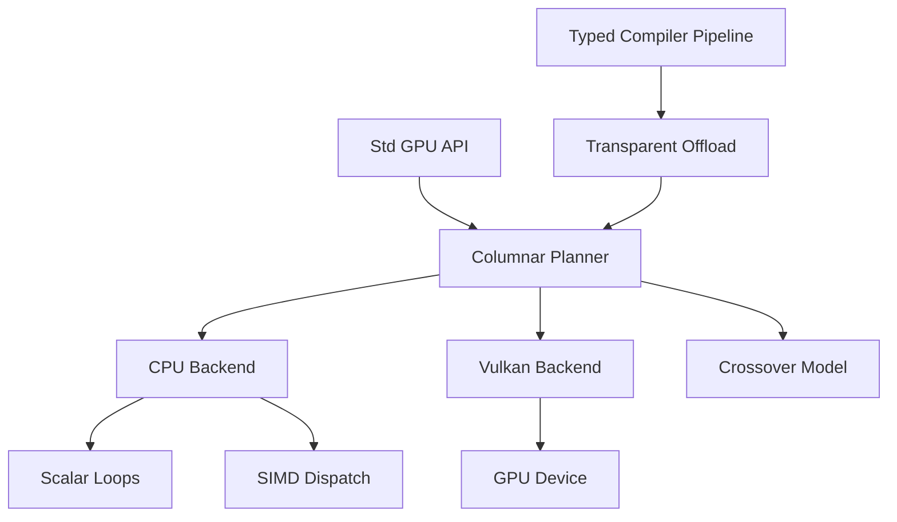

# Accelerated Columnar Execution

Yona's accelerator story starts as a columnar execution layer with multiple
backends. GPU execution is one backend; an optimized CPU backend is equally
important because small and medium inputs often lose to transfer and launch
overhead.

## Goals

- Provide an explicit `Std\GPU` API for batch-oriented primitive columns.
- Keep the baseline compiler, runtime, and packages usable without GPU SDKs.
- Use CPU scalar/SIMD fallback everywhere, including CI and unsupported hosts.
- Add Vulkan as the first real GPU backend after the API and ABI are stable.
- Gate transparent compiler offload on benchmark evidence, not assumptions.

## Execution Model

The first implementation exposes `Std\GPU.Buffer` as an opaque wrapper around
an `IntArray`. `upload` and `materialize` copy data even on the CPU backend so
programs already observe transfer-like ownership boundaries. Future Vulkan or
vendor backends can replace the backing storage with device handles without
changing the high-level operation set.

## Backends

### CPU Scalar

The scalar backend is always available. It provides correctness and portability
for every platform where the Yona runtime builds.

### CPU SIMD

The CPU fallback is not a dummy path. Hot primitive kernels should be written as
contiguous loops that auto-vectorize, and selected reductions may use explicit
portable CPU extensions when they are available at compile time. The initial
backend reports `cpu-simd` on targets with x86 SSE2 or AArch64 NEON support and
`cpu-scalar` otherwise.

The benchmark suite should compare scalar/SIMD CPU and GPU results before the
compiler chooses any transparent offload.

### Vulkan

Vulkan is the first planned GPU backend because it is cross-vendor and already
matches the roadmap. It should remain optional and feature-gated. Hosts without
Vulkan keep using the CPU backend.

The runtime includes a Vulkan capability scaffold. By default it uses
`LoadLibrary` / `dlopen` on the loader only and does not require the SDK.
Optionally, configure with `-DYONA_ENABLE_VULKAN=ON` and `VULKAN_SDK` so
`gpu_vulkan.c` compiles against `vulkan/vulkan.h` (see `cmake/YonaVulkan.cmake`).
When the runtime is built **with** Vulkan headers (`-DYONA_ENABLE_VULKAN=ON` at
configure), `Std\GPU.vulkanStatus` can also report `vulkan-device` after a
successful instance/device/compute-queue init; entry points are resolved at
runtime from the platform loader (**no** import-library link on the main
executable).

**`hasGpu`:** `true` only when the runtime was built with Vulkan headers, Vulkan
is not disabled with `YONA_GPU_DISABLE_VULKAN`, `try_init` succeeds, and the
logical device exposes `shaderInt64` (required for the embedded int64 SSBO
kernels). The result is cached per process and cleared by
`yona_gpu_vulkan_device_shutdown()`.

**Opt-in Vulkan compute** (`src/runtime/gpu_vulkan_ops.c`, included from
`gpu_vulkan_device.c`): `mapAdd`, `mapMul`, and `reduceSum` can use a Vulkan path
when enabled. Set **`YONA_GPU_VULKAN_COMPUTE=1`** to allow all three, or enable
individually with **`YONA_GPU_VULKAN_MAPADD=1`**, **`YONA_GPU_VULKAN_MAPMUL=1`**, or
**`YONA_GPU_VULKAN_REDUCE=1`**. Minimum column length defaults to **4096**; override
with **`YONA_GPU_VULKAN_MIN_LEN`** or the per-op `*_MIN_LEN` variables. Pipelines
are cached; queue submit and fence wait are serialized with a dedicated mutex.
**`mapAdd` / `mapMul`:** When a **device-local, non-host-visible** memory type is
available for the SSBO, the runtime uses a **staging buffer** (host coherent),
`vkCmdCopyBuffer` upload, compute on device-local memory, then copy back for
readback. Integrated GPUs without a separate VRAM heap keep the prior
**single host-visible SSBO** path. Force the host path with
**`YONA_GPU_VULKAN_HOST_SSBO=1`** (debug / regression).

**`reduceSum`:** Still uses **host-visible** SSBOs for both the column and the
per-block partial sums (smaller footprint than map; full device-local + staging
for both bindings can follow the same pattern as `mapAdd`).

| Variable | Effect |
|----------|--------|
| `YONA_GPU_VULKAN_COMPUTE=1` | Enable Vulkan `mapAdd`, `mapMul`, and `reduceSum`. |
| `YONA_GPU_VULKAN_MAPADD=1` | Enable Vulkan `mapAdd` only. |
| `YONA_GPU_VULKAN_MAPMUL=1` | Enable Vulkan `mapMul` only. |
| `YONA_GPU_VULKAN_REDUCE=1` | Enable Vulkan `reduceSum` only. |
| `YONA_GPU_VULKAN_MIN_LEN` | Global minimum `IntArray` length (default 4096). |
| `YONA_GPU_VULKAN_MAPADD_MIN_LEN` | Override min length for `mapAdd`. |
| `YONA_GPU_VULKAN_MAPMUL_MIN_LEN` | Override min length for `mapMul`. |
| `YONA_GPU_VULKAN_REDUCE_MIN_LEN` | Override min length for `reduceSum`. |
| `YONA_GPU_DISABLE_VULKAN` | Any value other than `0` disables loader use and GPU paths. |
| `YONA_GPU_VULKAN_PHYSICAL_DEVICE_INDEX` | Non-negative index into `vkEnumeratePhysicalDevices` order. |

Generated API notes for `Std\GPU` also appear in `docs/api/GPU.md` (`python3 scripts/gendocs.py`).

**`Std\GPU.vulkanLastNote`:** short string from the last failed device init or
opt-in GPU attempt (`yona_gpu_vulkan_device_last_note()`); empty after success or
when Vulkan was not compiled in.

**`filterGreaterThan`** remains CPU-only (variable output size; no GPU path yet).

Codegen E2E runs `gpu_backend_flags` and `gpu_vulkan_last_note` with
`YONA_GPU_DISABLE_VULKAN=1` in the child process so expectations stay stable on
developer machines that have a loader installed.

**Physical device selection (generic):** `vkEnumeratePhysicalDevices` order is
not guaranteed to match vendor tools or OS GPU preference. The runtime scores
every adapter that exposes a compute queue: discrete GPU is preferred over
integrated/virtual/CPU, and among ties `shaderInt64` and higher
`apiVersion` break ties so int64 compute (e.g. embedded SPIR-V mapAdd) prefers a
capable discrete part on hybrid laptops. Override for debugging with
`YONA_GPU_VULKAN_PHYSICAL_DEVICE_INDEX` (non‑negative index into the same
enumeration order Vulkan returns). After a failed init or failed opt-in GPU
path, `yona_gpu_vulkan_device_last_note()` returns a short implementation hint
(empty after success).

**P0 (optional SDK build):** CMake finds headers and the loader library path
(Option A); the main Yona program is **not** linked to `vulkan-1` yet so
machines without a loader DLL can still run CPU-only binaries. `yonac` matches
CMake when `YONA_COMPILE_GPU_VULKAN=1` and `VULKAN_SDK` are set (see
`cli/main.cpp` and `docs/gpu-vulkan-implementation-plan.md`).

**Testing:** The unit-test harness compiles `compiled_runtime.c` from sources.
Do **not** leave `YONA_COMPILE_GPU_VULKAN=1` in your shell when running
`tests.exe` by hand unless you are debugging the Vulkan-enabled runtime path;
CTest sets `YONA_COMPILE_GPU_VULKAN=0` so `ctest` stays stable even if your
profile exports Vulkan build variables.

## Supported Data

The initial subset is intentionally narrow:

- Primitive numeric columns, starting with `IntArray`.
- Batch operations such as map, filter, and reduction.
- Explicit upload/materialize boundaries.

The initial subset excludes arbitrary heap values, ADTs, strings, closures,
effects, exceptions, and channels inside kernels. Those constructs carry host
runtime semantics that do not belong in a first device ABI.

## Runtime ABI

The runtime ABI should stay C-shaped and backend-neutral:

- Upload host column data into backend-owned storage.
- Materialize backend storage back into host columns.
- Query backend capabilities.
- Run primitive columnar kernels.

The current CPU backend is compiled into `compiled_runtime.c` through
`src/runtime/gpu_cpu.c`. Vulkan loader probing is in `src/runtime/gpu_vulkan.c`;
device init, cached compute pipelines, and opt-in kernels live in
`src/runtime/gpu_vulkan_device.c` (which `#include`s `gpu_vulkan_compute.c` and
`gpu_vulkan_ops.c`), all gated by `include/yona/runtime/gpu_build_config.h` and
`YONA_COMPILE_GPU_VULKAN`. Default builds omit the Khronos headers; optional SDK
builds compile them in. The public `Std\GPU` ABI stays in `gpu_cpu.c` (wrappers
and capability reporting), not a mandatory link dependency on the default
toolchain.

## Transparent Lowering

Transparent lowering is a later compiler pass. It may only select expressions
that are pure, numeric, shape-known, and free of host runtime effects. The pass
should lower into the same columnar planner/runtime ABI used by explicit
`Std\GPU` programs rather than creating a second accelerator system.

## Benchmark Policy

GPU decisions need a crossover model:

- Host transfer time.
- Kernel time.
- End-to-end time.
- Input row count.
- Operation mix.
- Peak memory where available.

Compiler-selected offload is allowed only when these measurements show a stable
win for the target operation family.
