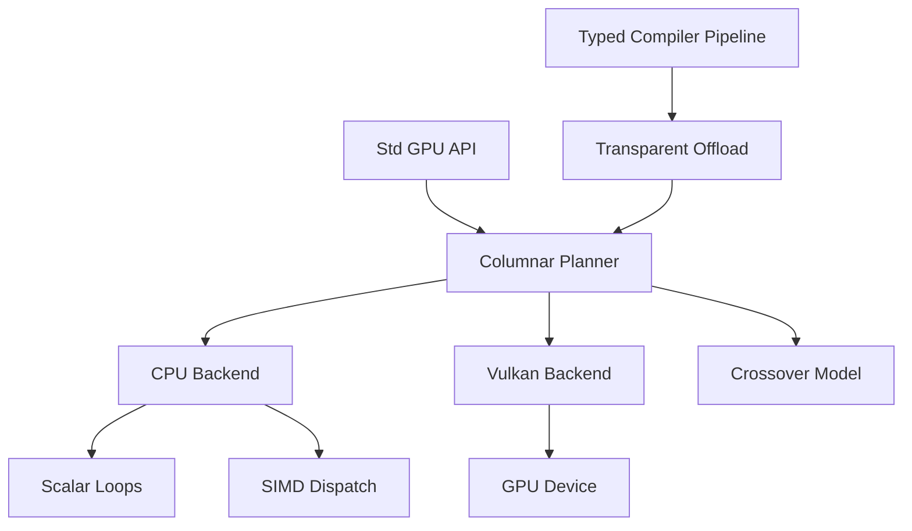

# Accelerated Columnar Execution

Yona's accelerator story starts as a columnar execution layer with multiple
backends. GPU execution is one backend; an optimized CPU backend is equally
important because small and medium inputs often lose to transfer and launch
overhead.

## Goals

- Provide an explicit `Std\GPU` API for batch-oriented primitive columns.
- Keep the baseline compiler, runtime, and packages usable without GPU SDKs.
- Use CPU scalar/SIMD fallback everywhere, including CI and unsupported hosts.
- Add Vulkan as the first real GPU backend after the API and ABI are stable.
- Gate transparent compiler offload on benchmark evidence, not assumptions
  (see **`docs/gpu-transparent-lowering.md`** — *Benchmark corpus* and `bench/run_gpu_compare.py --json-report`).

## Execution Model

The first implementation exposes `Std\GPU.Buffer` as an opaque wrapper around
an `IntArray`. `upload` and `materialize` copy data even on the CPU backend so
programs already observe transfer-like ownership boundaries. Future Vulkan or
vendor backends can replace the backing storage with device handles without
changing the high-level operation set.

## Backends

### CPU Scalar

The scalar backend is always available. It provides correctness and portability
for every platform where the Yona runtime builds.

### CPU SIMD

The CPU fallback is not a dummy path. Hot primitive kernels should be written as
contiguous loops that auto-vectorize, and selected reductions may use explicit
portable CPU extensions when they are available at compile time. The initial
backend reports `cpu-simd` on targets with x86 SSE2 or AArch64 NEON support and
`cpu-scalar` otherwise.

The benchmark suite should compare scalar/SIMD CPU and GPU results before the
compiler chooses any transparent offload.

### Vulkan

Vulkan is the first planned GPU backend because it is cross-vendor and already
matches the roadmap. It should remain optional and feature-gated. Hosts without
Vulkan keep using the CPU backend.

The runtime includes a Vulkan capability scaffold. By default it uses
`LoadLibrary` / `dlopen` on the loader only and does not require the SDK.
Optionally, configure with `-DYONA_ENABLE_VULKAN=ON` and `VULKAN_SDK` (or, on
macOS, Homebrew `vulkan-headers` + `molten-vk` / `vulkan-loader` via
`HOMEBREW_PREFIX` or `brew --prefix`) so `gpu_vulkan.c` compiles against
`vulkan/vulkan.h` (see `cmake/YonaVulkan.cmake`).
When the runtime is built **with** Vulkan headers (`-DYONA_ENABLE_VULKAN=ON` at
configure), `Std\GPU.vulkanStatus` can also report `vulkan-device` after a
successful instance/device/compute-queue init; entry points are resolved at
runtime from the platform loader (**no** import-library link on the main
executable).

**`hasGpu`:** `true` when the runtime was built with Vulkan headers, Vulkan
is not disabled with `YONA_GPU_DISABLE_VULKAN`, and `try_init` succeeds.
IntArray kernels use i64 SSBOs when the device exposes `shaderInt64`; otherwise
they narrow to i32 when every value and the op result fit in `int32_t`, then
widen back. Values outside that range stay on the CPU. `filterGreaterThan`
uses the same i32 narrow path when `shaderInt64` is missing. The result is cached per process and cleared by
`yona_gpu_vulkan_device_shutdown()`.

**Opt-in Vulkan compute** (`src/runtime/gpu_vulkan_ops.c`, included from
`gpu_vulkan_device.c`): `mapAdd`, `mapMul`, `reduceSum`, and `filterGreaterThan`
can use a Vulkan path when enabled. Set **`YONA_GPU_VULKAN_COMPUTE=1`** to allow
all four, or enable individually with **`YONA_GPU_VULKAN_MAPADD=1`**, **`YONA_GPU_VULKAN_MAPMUL=1`**, **`YONA_GPU_VULKAN_REDUCE=1`**, or **`YONA_GPU_VULKAN_FILTER=1`**. Minimum column length defaults to **4096**; override
with **`YONA_GPU_VULKAN_MIN_LEN`** or the per-op `*_MIN_LEN` variables. Pipelines
are cached; queue submit and fence wait are serialized with a dedicated mutex.
**`mapAdd` / `mapMul`:** When a **device-local, non-host-visible** memory type is
available for the SSBO, the runtime uses a **staging buffer** (host coherent),
`vkCmdCopyBuffer` upload, compute on device-local memory, then copy back for
readback. Integrated GPUs without a separate VRAM heap keep the prior
**single host-visible SSBO** path. Force the host path with
**`YONA_GPU_VULKAN_HOST_SSBO=1`** (debug / regression).

**`reduceSum`:** Uses the same rule as `mapAdd` / `mapMul`: when a **device-local,
non-host-visible** heap exists and **`YONA_GPU_VULKAN_HOST_SSBO`** is not set, the
input column and block-sum buffers are **device-local** with **staging** copies
(upload, dispatch, copy partial sums back for the host tail sum). Otherwise both
bindings stay **host-visible** SSBOs.

| Variable | Effect |
|----------|--------|
| `YONA_GPU_VULKAN_COMPUTE=1` | Enable Vulkan `mapAdd`, `mapMul`, `reduceSum`, and `filterGreaterThan`. |
| `YONA_GPU_VULKAN_MAPADD=1` | Enable Vulkan `mapAdd` only. |
| `YONA_GPU_VULKAN_MAPMUL=1` | Enable Vulkan `mapMul` only. |
| `YONA_GPU_VULKAN_REDUCE=1` | Enable Vulkan `reduceSum` only. |
| `YONA_GPU_VULKAN_FILTER=1` | Enable Vulkan `filterGreaterThan` only (mark + GPU prefix + scatter). |
| `YONA_GPU_VULKAN_FILTER_CPU_PREFIX=1` | Force legacy host exclusive-prefix between mark and scatter (debug / regression). |
| `YONA_GPU_VULKAN_MIN_LEN` | Global minimum `IntArray` length (default 4096). |
| `YONA_GPU_VULKAN_MAPADD_MIN_LEN` | Override min length for `mapAdd`. |
| `YONA_GPU_VULKAN_MAPMUL_MIN_LEN` | Override min length for `mapMul`. |
| `YONA_GPU_VULKAN_REDUCE_MIN_LEN` | Override min length for `reduceSum`. |
| `YONA_GPU_VULKAN_FILTER_MIN_LEN` | Override min length for `filterGreaterThan`. |
| `YONA_GPU_DISABLE_VULKAN` | Any value other than `0` disables loader use and GPU paths. |
| `YONA_GPU_VULKAN_PHYSICAL_DEVICE_INDEX` | Non-negative index into `vkEnumeratePhysicalDevices` order. |
| `YONA_GPU_VULKAN_HOST_SSBO=1` | Force host-visible SSBOs only (no device-local + staging); for debugging and parity tests. |
| `YONA_GPU_VULKAN_FORCE_I32=1` | Use i32 kernels even when `shaderInt64` is present (debug / tests). |

**`FloatArray` f64 (Vulkan builds, lazy `VkDevice` from `gpu_stub.c`):** **`floatArrayScaleAsync`**
and **`floatArrayMul2Async`** (`extern native`, `Promise Int` at call sites) share the
embedded SPIR-V from **`gpu_f64_mul2.comp`** (push constants: element count + `double` scale;
`mul2` uses `scale = 2.0`; regenerate `include/runtime/gpu_f64_mul2_spv.inl` with
`scripts/gen_gpu_f64_mul2_spv.sh`). They use `shaderFloat64` when present;
otherwise they narrow host doubles to f32 (`gpu_f32_scale.comp` /
`scripts/gen_gpu_f32_scale_spv.sh`), run the f32 kernel, and widen back.
Async scale without `shaderFloat64` completes via that synchronous f32 path.
See **`docs/design-gpu-async.md`** and doctests `YONA_GPU_TEST_F64_MUL2*`.

Generated API notes for `Std\GPU` also appear in `docs/api/GPU.md` (`python3 scripts/gendocs.py`).

**Vulkan optional tests:** With `YONA_COMPILE_GPU_VULKAN`, `test/gpu_vulkan_mapadd_test.cpp`
runs doctest cases against `yona_gpu_vulkan_try_*`. They **skip** (with a MESSAGE)
when no suitable device or init failure—so default CI stays green without a GPU.
When Vulkan succeeds, cases check roundtrips and **`YONA_GPU_VULKAN_HOST_SSBO=1`**
parity against the default path (staging vs host-mapped SSBOs must match).

**Wall-clock benchmarks:** `bench/run_gpu_compare.py` times the same accelerator
`.yona` programs (hot paths plus **10k / 5k crossover-size** variants under
`bench/accelerators/`) with Vulkan forced off vs `YONA_GPU_VULKAN_COMPUTE=1`,
then prints a **summary table** (CPU avg ms, GPU avg ms, delta %, verdict). Use
`--json-report` for archivable metadata; `bench/gpu_bench_meta.py` prints row
counts and `let x = N in` bindings from sources where present. See `bench/README.md`, section **GPU / Vulkan**, and
`docs/gpu-transparent-lowering.md` (*Benchmark corpus*).

**`Std\GPU.vulkanLastNote`:** short string from the last failed device init,
opt-in int-column GPU attempt, **`vkWaitForFences`** failure on **`floatArray*Async`**,
or **`VkResult`** / allocation failures on the sync float dispatch / test **nop**
path (`gpu_stub.c` records the failing entry point name); mapped through
**`yona_gpu_vulkan_device_last_note()`**; empty after success or when Vulkan was
not compiled in.

**`filterGreaterThan`:** Optional Vulkan path (same env pattern as above): GPU
**mark** pass, **GPU** inclusive prefix (doubling scan on int64 flags) plus a small
compute kernel for **exclusive** indices, then GPU **scatter** into a packed buffer.
The implementation reads a single int64 (**total match count**) from the end of
the inclusive scan between submits so the result `IntArray` can be allocated before
scatter. When a device-local heap exists and **`YONA_GPU_VULKAN_HOST_SSBO`** is not
set, the main column/flags/prefix/out buffers use **device-local** memory with
**staging** where needed; two extra **device-local** ping-pong buffers hold the
prefix scan (plus an 8-byte host staging slice for the count on the staging path).
Otherwise the same pipeline uses **host-visible** buffers including the scan pair.
Set **`YONA_GPU_VULKAN_FILTER_CPU_PREFIX=1`** to revert to the older CPU exclusive
prefix for A/B checks. Order matches the CPU implementation.

Codegen E2E runs `gpu_backend_flags` and `gpu_vulkan_last_note` with
`YONA_GPU_DISABLE_VULKAN=1` in the child process so expectations stay stable on
developer machines that have a loader installed.

**Physical device selection (generic):** `vkEnumeratePhysicalDevices` order is
not guaranteed to match vendor tools or OS GPU preference. The runtime scores
every adapter that exposes a compute queue: discrete GPU is preferred over
integrated/virtual/CPU, and among ties `shaderInt64` and higher
`apiVersion` break ties so int64 compute (e.g. embedded SPIR-V mapAdd) prefers a
capable discrete part on hybrid laptops. Override for debugging with
`YONA_GPU_VULKAN_PHYSICAL_DEVICE_INDEX` (non‑negative index into the same
enumeration order Vulkan returns). After a failed init or failed opt-in GPU
path, `yona_gpu_vulkan_device_last_note()` returns a short implementation hint
(empty after success).

**P0 (optional SDK build):** CMake finds Vulkan headers when enabled; **`yona` /
`tests`** builds keep **runtime-loaded** Vulkan where designed so loader-less
hosts can still run CPU paths. **`yonac`**-linked executables that import **`vk*`** from
**`gpu_stub`** resolve **`vulkan-1`** at link time — on **Windows**, prefer the import
library path recorded at CMake configure (**`INSTALL.md`**), with **`VULKAN_SDK`** as
fallback (**`cli/main.cpp`**, **`docs/gpu-vulkan-implementation-plan.md`**).

**Testing:** The unit-test harness compiles `compiled_runtime.c` from sources.
Do **not** leave `YONA_COMPILE_GPU_VULKAN=1` in your shell when running
`tests.exe` by hand unless you are debugging the Vulkan-enabled runtime path;
CTest sets `YONA_COMPILE_GPU_VULKAN=0` so `ctest` stays stable even if your
profile exports Vulkan build variables.

Optional doctests (`test/gpu_stub_test.cpp`): set **`YONA_GPU_TEST_DISPATCH=1`**
(nop dispatch), **`YONA_GPU_TEST_F64_MUL2=1`** / **`YONA_GPU_TEST_F64_MUL2_ASYNC=1`**
(f64 scale kernel, sync or promise), or **`YONA_GPU_TEST_F64_GROUP_CANCEL=1`**
(`yona_rt_group_cancel` → promise result **-887**: after a successful fence wait
the buffer may still be updated; if the group is already cancelled before **`vkQueueSubmit`**,
the path skips submit and completes **-887** without dispatch). All require a successful
`yona_gpu_vulkan_ctx_init` and
`shaderFloat64` when present, otherwise the f32 narrow/widen fallback; **-20**
only if neither float pipeline can be created.

## Vulkan limitations (Windows / Linux)

Intentional guardrails and **known gaps** for the baseline Vulkan stack.
Apple/MoltenVK device init is in **`docs/gpu-vulkan-implementation-plan.md`** §11
(`shaderInt64` is usually unavailable on Metal; IntArray GPU then uses i32).

- **`vulkanTimelineSemaphore`:** **`true`** when **`vkGetPhysicalDeviceFeatures2`**
  (**or `…KHR`**) reports **`VkPhysicalDeviceVulkan12Features::timelineSemaphore`**
  on a Vulkan **1.2+** physical device, **or** when **`VK_KHR_timeline_semaphore`**
  appears in **`vkEnumerateDeviceExtensionProperties`** for the chosen device (covers
  **1.0 / 1.1** stacks that expose timeline semaphores only as an extension). **Submission**
  still uses **`VkFence`** per queue submit (`gpu_vulkan_ops.c`, async float path in
  `gpu_stub.c`); **`vkQueueSubmit2`** / **`VK_KHR_synchronization2`** are **not** wired yet.
- **`vulkanLastNote`:** Single shared buffer (**not** a structured log); useful for logs
  and debugging, **not** a substitute for a typed **`perform Gpu`** / capability effect
  (see backlog in `docs/todo-list.md`).
- **Doctest scratch compile** (`test/yona_link_util.hpp`): Vulkan SDK headers plus
  **`DYONA_COMPILE_GPU_VULKAN=1`** apply to the scratch **`compiled_runtime.c`** object when
  the env var is set, but **`YONA_HAS_VULKAN` is not defined** there, so **`gpu_stub.c`**
  stays on its non-Vulkan branch and linked subprocess executables avoid **`vk*`** symbols
  from that TU. **`ctest`** normally forces **`YONA_COMPILE_GPU_VULKAN=0`** anyway (`CLAUDE.md`).
- **`yonac` user links (Windows):** prefers **`vulkan-1.lib`** from CMake configure output;
  **`VULKAN_SDK`** is fallback (`INSTALL.md`).

## Roadmap implementation status

This table tracks *large* remaining items from `docs/design-gpu-async.md` and
`docs/todo-list.md`. Shipped pieces (columnar `Std\GPU`, optional Vulkan int64
kernels, `floatArrayMul2Async` / `floatArrayScaleAsync`, accelerator JSON) are
omitted here.

| Topic | Status |
|-------|--------|
| **`mapGPU` / `reduceGPU` (user kernels from Yona functions)** | Not implemented — needs closure → SPIR-V or embedded op table, typing, and Perceus/lifetime rules for device buffers. |
| **Timeline semaphores / `VK_KHR_synchronization2`** | **Partial:** device init enables **KHR timeline + synchronization2** when supported (`gpu_vulkan_device.c`, **`gpu_stub.c`**). Async float (`floatArray*Async`) may use **`vkQueueSubmit2`** + timeline wait on the fence thread when **`YONA_GPU_ASYNC_TIMELINE`** is unset or non-`0` (set **`YONA_GPU_ASYNC_TIMELINE=0`** for the legacy **`VkFence`** path). No multi-kernel **synchronization2** barrier graphs yet. |
| **`vkDeviceWaitIdle` / `vkQueueWaitIdle` on hot paths** | **Avoided** for f64 async (per-fence wait only). **`vkDeviceWaitIdle`** remains on **intentional** `yona_gpu_vulkan_ctx_shutdown` (see `gpu_stub.c`). Int column path: `gpu_vulkan_ops.c` uses **fences**, not queue idle. |
| **Task-group cancel + GPU promises** | **Partial:** **-887** when the group is cancelled before the fence waiter finishes; if already cancelled before **`vkQueueSubmit`**, async float scale skips submit. In-flight GPU work is not aborted after submit. |
| **Pinned host buffers + CPU↔GPU channels** | Not implemented. |
| **Multi-stage command-buffer graphs (map→map→reduce)** | Not implemented (single-kernel or staged int filter pipeline only). |
| **GPU capability / effect for device-lost and OOM** | **Partial:** `vulkanLastNote` records `VkResult` text (OOM / device lost hints), async fence waiter failures, synchronous float dispatch, calloc-after-submit; no typed GPU effect yet. |
| **Transparent compiler lowering to GPU** | Deferred (needs benchmark gate + schedule story in `docs/gpu-transparent-lowering.md`). |
| **Windows: full `gpu_stub` Vulkan compute parity with Linux** | **Done** for the lazy `VkDevice` + f64 fence path: same `#if defined(YONA_HAS_VULKAN)` body on all non-Android targets; Windows uses `SRWLOCK` / `CONDITION_VARIABLE` / `InitOnce` / `CreateThread` for the fence waiter. |
| **macOS: MoltenVK / portability / `shaderInt64` reality** | **Device init + i32/f32 kernels:** runtime `dlopen` searches `VULKAN_SDK`, `HOMEBREW_PREFIX`, and the lib dir CMake recorded for `libvulkan.1.dylib` / `libMoltenVK.dylib` (bare names last); if `VK_ICD_FILENAMES` is unset, hints a discovered **`MoltenVK_icd.json`**. Instance enables **`VK_KHR_portability_enumeration`** when present; device enables **`VK_KHR_portability_subset`** when the ICD requires it. Unified memory uses the existing host-visible SSBO fallback (no discrete-only heap). **`shaderInt64` / `shaderFloat64`** are typically **false** on Metal — `hasGpu` is still 1 when the device is ready; IntArray `mapAdd` / `mapMul` / `reduceSum` / `filterGreaterThan` use i32 when values fit; `floatArray*Async` uses f32. `vulkanLastNote` mentions the missing int64 feature. |

**Float `extern native` benches:** `run_gpu_compare.py` includes **`float_scale`**
(`gpu_float_scale_hot.yona`): `floatArrayScaleAsync` awaits to **0** when
`yona_gpu_vulkan_ctx_init` succeeds and either the f64 or f32 scale pipeline
runs (built with `YONA_HAS_VULKAN`). On Windows, **`yonac`** links **`vulkan-1.lib`** from the path CMake recorded when **`find_package(Vulkan)`** succeeded, with **`VULKAN_SDK`** as a fallback (see `INSTALL.md`).
The **`Std\GPU` native wrappers** call **`ctx_init`** before
submit so Yona programs need not use the C-only API. The CPU vs Vulkan **env**
columns mainly affect IntArray columnar paths; for this float row both runs use
`gpu_stub` when the loader is available. Hosts without suitable hardware will
fail the golden output check (expected `0`).

## Supported Data

The initial subset is intentionally narrow:

- Primitive numeric columns, starting with `IntArray`.
- Batch operations such as map, filter, and reduction.
- Explicit upload/materialize boundaries.

The initial subset excludes arbitrary heap values, ADTs, strings, closures,
effects, exceptions, and channels inside kernels. Those constructs carry host
runtime semantics that do not belong in a first device ABI.

## Runtime ABI

The runtime ABI should stay C-shaped and backend-neutral:

- Upload host column data into backend-owned storage.
- Materialize backend storage back into host columns.
- Query backend capabilities.
- Run primitive columnar kernels.

The current CPU backend is compiled into `compiled_runtime.c` through
`src/runtime/gpu_cpu.c`. Vulkan loader probing is in `src/runtime/gpu_vulkan.c`;
device init, cached compute pipelines, and opt-in kernels live in
`src/runtime/gpu_vulkan_device.c` (which `#include`s `gpu_vulkan_compute.c` and
`gpu_vulkan_ops.c`), all gated by `include/yona/runtime/gpu_build_config.h` and
`YONA_COMPILE_GPU_VULKAN`. Default builds omit the Khronos headers; optional SDK
builds compile them in. The public `Std\GPU` ABI stays in `gpu_cpu.c` (wrappers
and capability reporting), not a mandatory link dependency on the default
toolchain.

## Transparent Lowering

Transparent lowering is a later compiler pass. It may only select expressions
that are pure, numeric, shape-known, and free of host runtime effects. The pass
should lower into the same columnar planner/runtime ABI used by explicit
`Std\GPU` programs rather than creating a second accelerator system.

## Benchmark Policy

GPU decisions need a crossover model:

- Host transfer time.
- Kernel time.
- End-to-end time.
- Input row count.
- Operation mix.
- Peak memory where available.

Compiler-selected offload is allowed only when these measurements show a stable
win for the target operation family.
