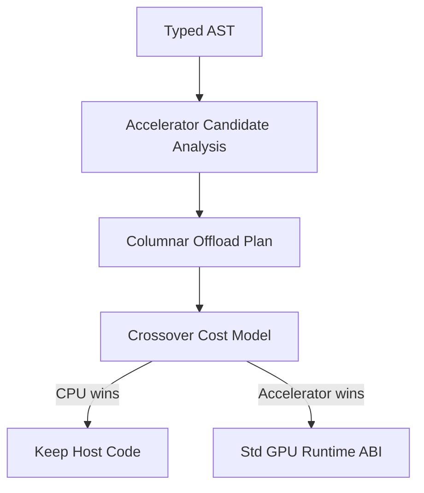

# Transparent Accelerator Lowering

Transparent accelerator lowering is intentionally behind the explicit
`Std\GPU` API and benchmark crossover model. The compiler should only offload
when it can prove that the transformed program preserves host semantics and the
benchmark model predicts a win.

## Compiler Hook

The lowering analysis should run after typechecking and before final codegen
selection. At that point the compiler has:

- A typed AST from the typechecker.
- Module/import metadata from `.yonai` files.
- Access to purity, ownership, and escape information used by codegen.

The pass should produce an accelerator plan rather than directly emitting
device code. Codegen can then lower that plan into calls to the same runtime ABI
used by `Std\GPU`.

## Candidate Shape

Initial candidates are pure columnar pipelines over primitive arrays:

- `IntArray` and later `FloatArray` inputs.
- Map with arithmetic or comparison expressions.
- Filter predicates over a single row value.
- Reductions with associative operations such as sum, min, and max.
- Materialization only at explicit host boundaries.

The pass must reject:

- Effects, `perform`, and handlers.
- Exceptions and `try`/`catch`.
- Channels, tasks, and blocking operations.
- Unknown extern calls.
- Heap object traversal, strings, ADTs, closures, sets, and dicts inside the
  candidate kernel.
- Order-dependent observable behavior.

## Lowering Path

The first implementation should only emit plans that could also be written by
hand with `Std\GPU`: upload, primitive map/filter/reduce kernels, and
materialize. This keeps transparent lowering from creating a second execution
system.

## Crossover Inputs

The cost model should be populated from benchmark data:

- Input row count.
- Bytes transferred host-to-backend and backend-to-host.
- Number of kernels launched.
- CPU scalar/SIMD time.
- GPU backend time when available.
- End-to-end time including materialization.

When data is missing, the compiler should keep CPU code.

## Benchmark corpus (before any transparent lowering)

Transparent lowering should not ship until there is **repeatable evidence** for the
shapes the compiler would emit. Today that means:

1. **Explicit `Std\GPU` programs** — The accelerators under `bench/accelerators/`
   include the large hot paths (`gpu_map_reduce_hot.yona`, `gpu_filter_hot.yona`,
   …) and smaller **crossover-size** variants (`gpu_map_reduce_10k.yona`,
   `gpu_filter_10k.yona`, `gpu_columnar_pipeline_5k.yona`,
   `gpu_materialize_sum_5k.yona`). Each has a `.expected` file; correctness is
   checked before timing.

2. **`bench/gpu_bench_meta.py`** — Prints JSON with approximate **`build N`** row
   counts (and **`filterGreaterThan`** thresholds when present, plus **`let x = N in`**
   integer bindings such as **`gpu_float_scale_hot`**) for each
   `bench/accelerators/gpu_*.yona`. Run before or alongside **`--json-report`**
   so crossover spreadsheets include problem size.

3. **`bench/run_gpu_compare.py`** — Runs the same compiled executable twice:
   **`YONA_GPU_DISABLE_VULKAN=1`** (CPU backend) vs **`YONA_GPU_VULKAN_COMPUTE=1`**
   with **`YONA_GPU_VULKAN_MIN_LEN=1`** (Vulkan path when the machine supports it).
   It prints wall-clock ms and optional **`--json`** output. For a **single file**
   suitable for archiving (host, yonac path, iterations, `-O`, per-bench timings),
   use **`--json-report`** (see script `--help`).

4. **What you should still record by hand** for crossover modeling (until the
   runtime exposes counters): GPU model/driver, physical vs integrated GPU,
   approximate row count from the `.yona` source, and whether results matched
   CPU-only output. Row count and transfer bytes can later be filled by compiler
   diagnostics once candidate analysis exists.

5. **Paired “plain IntArray” vs `Std\GPU`” programs** (optional but strong) —
   Same numeric result, one version using only prelude/list/IntArray loops and one
   using `upload` / kernels / `materialize`. Parity proves the offload shape matches
   host semantics; wall time difference bounds what transparent lowering can hope
   to save once call overhead is removed.

Document published numbers in a machine-specific note (e.g. wiki or
`docs/benchmark-results-*.md`) and treat them as **hints** for defaults, not
universal constants.

## Rollout

1. **Benchmark corpus** — Collect `run_gpu_compare.py` runs (use `--json-report`)
   on representative hardware; document row counts and environment (see
   *Benchmark corpus* above). No compiler changes required.
2. Emit diagnostics-only candidate reports — `yonac --emit-accelerator-report file.yona` prints JSON
   (`yona.accelerator_diag.v1`) listing explicit `Std\GPU` kernel-shaped call sites, then exits (no
   codegen). **Expression programs:** after typecheck + `solve_constraints`; root has
   `"report_kind":"program"`; optional `inferred_type` per site. **Modules:** default is an AST scan
   of function / extern / instance / trait-default bodies (`"report_kind":"module_ast"`). With
   `--emit-accelerator-report-with-types`, the same surfaces are typechecked first; root is
   `"report_kind":"module"` and sites may include `inferred_type`. Root may include `file` (source
   path). Each site has `op`, `binding` (`import` or `Std\GPU` FQN), `api_signature` (surface type
   from `Std\GPU` exports), `line`, and `column`. Use `-I` like a normal compile where imports matter.
3. Add an opt-in compiler flag for transparent lowering experiments.
4. Compare generated offload against explicit `Std\GPU` code.
5. Enable default lowering only for operation families with stable crossover
   wins across supported platforms.
