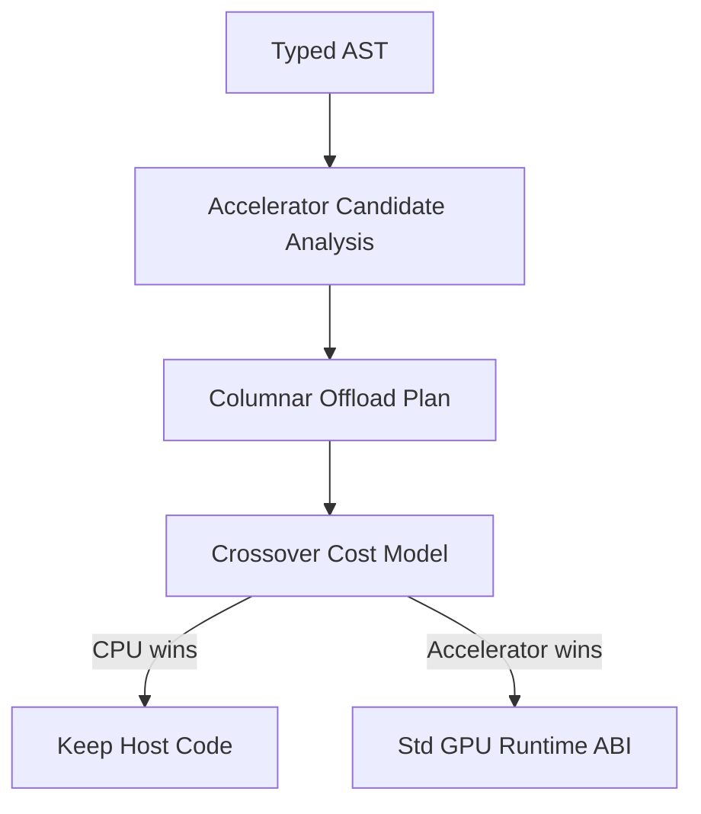

# Transparent Accelerator Lowering

Transparent accelerator lowering is intentionally behind the explicit
`Std\GPU` API and benchmark crossover model. The compiler should only offload
when it can prove that the transformed program preserves host semantics and the
benchmark model predicts a win.

## Compiler Hook

The lowering analysis should run after typechecking and before final codegen
selection. At that point the compiler has:

- A typed AST from the typechecker.
- Module/import metadata from `.yonai` files.
- Access to purity, ownership, and escape information used by codegen.

The pass should produce an accelerator plan rather than directly emitting
device code. Codegen can then lower that plan into calls to the same runtime ABI
used by `Std\GPU`.

## Candidate Shape

Initial candidates are pure columnar pipelines over primitive arrays:

- `IntArray` and later `FloatArray` inputs.
- Map with arithmetic or comparison expressions.
- Filter predicates over a single row value.
- Reductions with associative operations such as sum, min, and max.
- Materialization only at explicit host boundaries.

The pass must reject:

- Effects, `perform`, and handlers.
- Exceptions and `try`/`catch`.
- Channels, tasks, and blocking operations.
- Unknown extern calls.
- Heap object traversal, strings, ADTs, closures, sets, and dicts inside the
  candidate kernel.
- Order-dependent observable behavior.

## Lowering Path

The first implementation should only emit plans that could also be written by
hand with `Std\GPU`: upload, primitive map/filter/reduce kernels, and
materialize. This keeps transparent lowering from creating a second execution
system.

## Crossover Inputs

The cost model should be populated from benchmark data:

- Input row count.
- Bytes transferred host-to-backend and backend-to-host.
- Number of kernels launched.
- CPU scalar/SIMD time.
- GPU backend time when available.
- End-to-end time including materialization.

When data is missing, the compiler should keep CPU code.

## Rollout

1. Emit diagnostics-only candidate reports for benchmarks.
2. Add an opt-in compiler flag for transparent lowering experiments.
3. Compare generated offload against explicit `Std\GPU` code.
4. Enable default lowering only for operation families with stable crossover
   wins across supported platforms.
