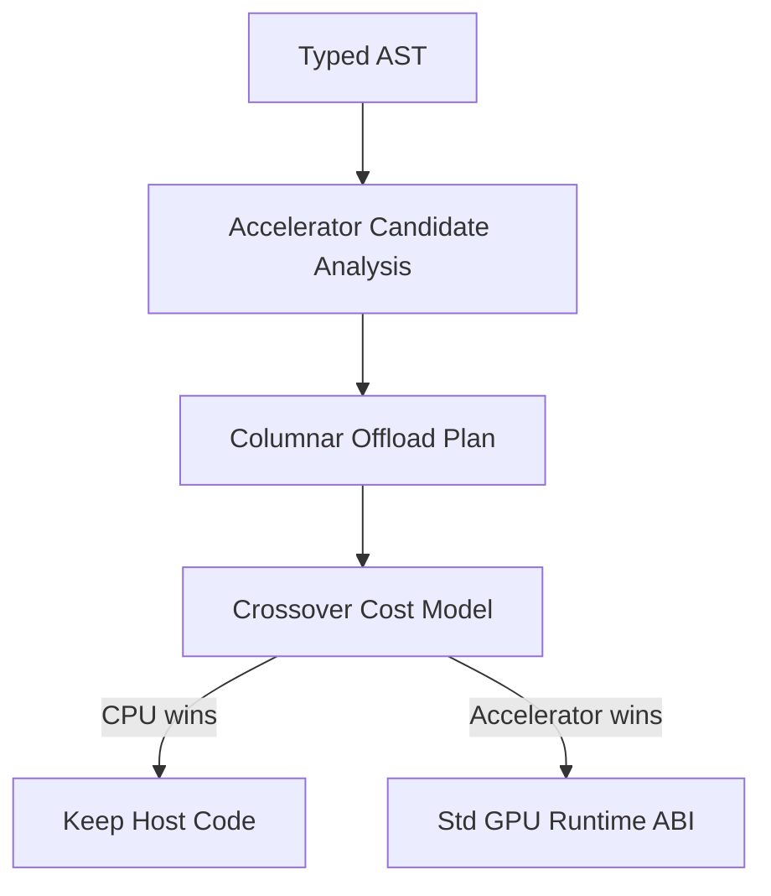

# Transparent Accelerator Lowering

Transparent lowering rewrites recognized `Std\IntArray` / `Std\FloatArray`
`map` / `filter` / `foldl` shapes into the **same columnar runtime ABI** as
explicit `Std\Gpu` (`mapAdd`, `mapMul`, `filterGreaterThan`, `filterLessThan`,
`reduceSum`, `mapFloatScale`, `reduceFloatGpu`). There is no second device backend.

The compiler matches **inline lambdas** against the fixed kernel library
(stdlib op + lambda shape, not a GPU export-name allowlist). GPU vs CPU is
decided at **run time** by that ABI: IntArray kernels use documented
`YONA_GPU_VULKAN_MIN_LEN` (default 4096) and per-op env vars; float map/reduce
use the Vulkan device when `YonaRuntimeGpuVulkanContextInitialize` succeeds (same as
`mapFloatGpu`), else CPU. `yonac --no-accelerator-lowering` keeps the host
closure path. `yonac --strict-accelerator` turns unlowerable IntArray/FloatArray
`map` / `filter` / `foldl` lambdas into **E0700** (no SPIR-V from arbitrary
closures yet — host path remains correct without the flag).

## Compiler Hook

Analysis runs at codegen of `ApplyExpr` (imports already resolved). It
produces an `AccelMatch` plan (`include/yona/Codegen/AcceleratorLowering.h`); codegen
emits calls to the Std\Gpu raw C symbols. Named lambdas, `\x -> x + x * x`,
effects inside the lambda, and `Std\List.map` are not rewritten.

## Candidate Shape

Initial candidates are pure columnar pipelines over primitive arrays:

- `IntArray` and later `FloatArray` inputs.
- Map with arithmetic or comparison expressions.
- Filter predicates over a single row value.
- Reductions with associative operations such as sum, min, and max.
- Materialization only at explicit host boundaries.

The pass must reject:

- Effects, `perform`, and handlers.
- Exceptions and `try`/`catch`.
- Channels, tasks, and blocking operations.
- Unknown extern calls.
- Heap object traversal, strings, ADTs, closures, sets, and dicts inside the
  candidate kernel.
- Order-dependent observable behavior.

## Lowering Path

The implementation only emits plans that could also be written by hand with
`Std\Gpu` primitive map/filter/reduce kernels. This keeps transparent lowering
from creating a second execution system.

## Crossover Inputs

Length is usually unknown at compile time, so the compiler does **not** invent
a second size cutoff. Runtime already has the crossover knobs:

- IntArray: `YONA_GPU_VULKAN_MIN_LEN` (default 4096) and per-op `*_MIN_LEN`.
- Float: try the Vulkan device; use the CPU if initialization or dispatch fails.

Benchmark data still informs those runtime defaults (`bench/run_gpu_compare.py`).

## Benchmark corpus

The accelerators under `bench/accelerators/` remain the evidence for runtime
GPU vs CPU timing. Today that means:

1. **Explicit `Std\Gpu` programs** — The accelerators under `bench/accelerators/`
   include the large hot paths (`gpu_map_reduce_hot.yona`, `gpu_filter_hot.yona`,
   …) and smaller **crossover-size** variants (`gpu_map_reduce_10k.yona`,
   `gpu_filter_10k.yona`, `gpu_columnar_pipeline_5k.yona`,
   `gpu_materialize_sum_5k.yona`). Each has a `.expected` file; correctness is
   checked before timing.

2. **`bench/gpu_bench_meta.py`** — Prints JSON with approximate **`build N`** row
   counts (and **`filterGreaterThan`** thresholds when present, plus **`let x = N in`**
   integer bindings such as **`gpu_float_scale_hot`**) for each
   `bench/accelerators/gpu_*.yona`. Run before or alongside **`--json`**
   so crossover spreadsheets include problem size.

3. **`bench/run_gpu_compare.py`** — Runs the same compiled executable twice:
   **`YONA_GPU_DISABLE_VULKAN=1`** (CPU backend) vs **`YONA_GPU_VULKAN_COMPUTE=1`**
   with **`YONA_GPU_VULKAN_MIN_LEN=1`** (Vulkan path when the machine supports it).
   It prints wall-clock ms and optional **`--json`** output. For a **single file**
   suitable for archiving (host, yonac path, iterations, `-O`, per-bench timings),
   use **`--json`** (see script `--help`).

4. **What you should still record by hand** for crossover modeling (until the
   runtime exposes counters): GPU model/driver, physical vs integrated GPU,
   approximate row count from the `.yona` source, and whether results matched
   CPU-only output. Row count and transfer bytes can later be filled by compiler
   diagnostics once candidate analysis exists.

5. **Paired “plain IntArray” vs `Std\Gpu`” programs** (optional but strong) —
   Same numeric result, one version using only prelude/list/IntArray loops and one
   using `upload` / kernels / `materialize`. Parity proves the offload shape matches
   host semantics; wall time difference bounds what transparent lowering can hope
   to save once call overhead is removed.

Document published numbers in a machine-specific note (e.g. wiki or
`docs/benchmark-results-*.md`) and treat them as **hints** for defaults, not
universal constants.

## Status (2026-08-19)

**Shipped for the fixed kernel library** (inline lambdas only):

| Host op | Lambda shape | ABI |
|---------|--------------|-----|
| `Std\IntArray.map` | `\x -> x + k` / `k + x` (or `\x -> x + x` as `* 2`) | `YonaStdGpuRawMapAdd` / `__mapMul` |
| `Std\IntArray.map` | `\x -> x - k` (literal or runtime negate → `mapAdd`) | `YonaStdGpuRawMapAdd` |
| `Std\IntArray.map` | `\x -> 0 - x` | `YonaStdGpuRawMapMul` (`-1`) |
| `Std\IntArray.map` | `\x -> x * k` / `k * x` | `YonaStdGpuRawMapMul` |
| `Std\IntArray.map` | `\x -> x * x` | `YonaStdGpuRawMapSquare` |
| `Std\IntArray.filter` | `\x -> x > k` / `k < x` | `YonaStdGpuRawFilterGreaterThan` |
| `Std\IntArray.filter` | `\x -> x < k` | `YonaStdGpuRawFilterLessThan` (Vulkan LT mark shader when filter compute is on) |
| `Std\IntArray.foldl` | `\a b -> a + b` (or `b + a`) with init `0` | `YonaStdGpuRawReduceSum` |
| `Std\FloatArray.map` | `\x -> x * s` / `s * x` | `YonaStdGpuRawMapFloatScale` |
| `Std\FloatArray.foldl` | `\a b -> a + b` with init `0` / `0.0` | `YonaStdGpuRawReduceFloatGpu` |

Not lowered (host closure path): named lambdas, `\x -> x + x * x`, effects, `Std\List.map`, Buffer
programs that already call `mapAdd` / `mapGpu` explicitly.

`--emit-accelerator-report` prints JSON (`yona.accelerator_diag`). Explicit
`Std\Gpu` sites have `"kind":"explicit"`. Lowered host sites have `"kind":"transparent"`
and `"kernel"` (the ABI name). **Expression programs:** after typecheck + `solve_constraints`;
root has `"report_kind":"program"`. **Modules:** AST scan (`"module_ast"`) or
`--emit-accelerator-report-with-types` (`"module"`).

## Rollout (history)

1. **Benchmark corpus** — `run_gpu_compare.py --json` (see *Benchmark corpus* above).
2. Diagnostics-only reports — `--emit-accelerator-report` (still supported).
3. Compiler rewrite to the Std\Gpu ABI (this pass) — default on; `--no-accelerator-lowering` to disable.
4. Runtime GPU vs CPU remains the documented env / device gate (`docs/gpu-architecture.md`).
5. Wider families (arbitrary lambdas → SPIR-V, List, named functions) stay out of
   scope; use `--strict-accelerator` for an honest compile-time rejection
   (**E0700**) until a SPIR-V path exists.
