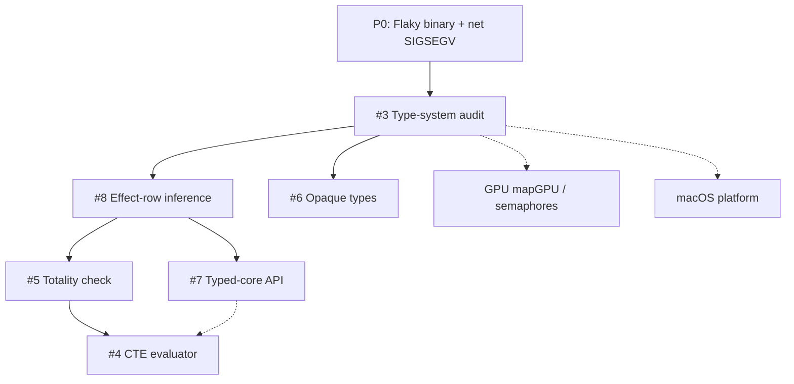

# Next Plan of Action (Aug 2026)

> **For agentic workers:** REQUIRED SUB-SKILL: Use `superpowers:subagent-driven-development` (recommended) or `superpowers:executing-plans` to implement **one phase at a time**. Each phase below should become its own detailed plan before coding when the work exceeds ~1 day. Steps use checkbox (`- [ ]`) syntax for tracking.

**Goal:** Stabilize flaky tests, produce an evidence-based type-system status matrix (GitHub #3), then execute type-system / compiler work in dependency order while keeping GPU and platform items on a parallel track that does not block correctness.

**Architecture:** Treat GitHub issues #3–#8 as the type-system program of record; treat `docs/todo-list.md` as the product/runtime program of record. Do not start compile-time evaluation (#4) or typed-core (#7) until the audit (#3) and effect-row story (#8) are honest about what already works. Fix flaky doctests before new language features so CI remains a trustworthy gate.

**Tech Stack:** Yona → LLVM 22 codegen (`yonac`), doctest, CMake presets (`x64-debug-linux` / `build-debug-linux`), GitHub issues on `yona-lang/yonac-llvm`, design docs under `docs/`.

## Global Constraints

- Prefer pure Yona over C unless syscalls / layout / measured hot paths require C (`CLAUDE.md` stdlib rule).
- New language features update lexer → parser → AST → codegen together; AST changes touch `include/ast.h`, `include/ast_visitor.h`, and codegen.
- Discoveries that are bugs go into `docs/todo-list.md` with a one-line repro before continuing.
- Do not silently expand scope past the active phase; open a GitHub issue or todo checkbox instead.
- Build/test defaults: `cmake --preset x64-debug-linux`, `cmake --build --preset build-debug-linux`, `ctest --preset unit-tests-linux` (or `./out/build/x64-debug-linux/tests -tc=…`).

---

## Current State Snapshot (2026-08-17)

### Shipped recently (HEAD ≈ `4207cb9` on `master`)

- Task-group bump arenas + raise unwind (`513ff84` lineage) and nested-fn arena IR isolation
- Windows parity, packaging/installer scaffold, transfer-scope O(1) droppability, borrow-aware `.yonai`
- `@borrow` first slice; `-Wunmatched-adt`
- `Std\GPU` columnar API + Vulkan map/mul/reduce/filter paths, accelerator diagnostics (`--emit-accelerator-report`), GPU crossover benches
- `extern native` + floatArrayMul2Async promise path
- Channel deadlock detection (listed under Completed Milestones — do **not** re-prioritize as greenfield)

### Local open work (`docs/todo-list.md`)

| Priority band | Item | Notes |
|---|---|---|
| **P0 bugs** | Flaky `binary_seek` / `binary_write_read` codegen fixtures | stdout sometimes `0` |
| **P0 bugs** | `net_runtime_test` TCP loopback SIGSEGV (intermittent) | Linux |
| **P1 tooling** | Windows Erlang OTP crash (`0xC0000005`) for `--compare-erl` | Outside runner; document/skip/WSL |
| **P1 language** | Type-level `&T` borrows | Design: `docs/design-borrow-types.md` |
| **P1 GPU** | `mapGPU` / timeline semaphores / task-group cancel | Design: `docs/design-gpu-async.md` |
| **P2 platform** | macOS kqueue + MoltenVK | Large; parallel track |
| **P2 distro** | Installer polish, embedded LLD default | After correctness |

### Open GitHub issues (all opened 2026-08-17)

| # | Title | Role in sequence |
|---|---|---|
| [#3](https://github.com/yona-lang/yonac-llvm/issues/3) | Audit advanced type-system features vs docs | **Foundation — do first** |
| [#8](https://github.com/yona-lang/yonac-llvm/issues/8) | Complete effect-row inference + `.yonai` propagation | After #3; unlocks totality + typed-core honesty |
| [#6](https://github.com/yona-lang/yonac-llvm/issues/6) | Opaque exported types / sealed constructors | Independent of #8; after #3 |
| [#5](https://github.com/yona-lang/yonac-llvm/issues/5) | Opt-in totality + effect-freedom checking | Needs #8 (empty row) + #3 honesty |
| [#4](https://github.com/yona-lang/yonac-llvm/issues/4) | Deterministic evaluator for pure total exprs | Needs #5 (and ideally typed input from #7 or typechecked AST) |
| [#7](https://github.com/yona-lang/yonac-llvm/issues/7) | Stable typed-core for external backends | Arch doc can start after #3; full API after #8 |



---

## Phase 0 — Stabilize CI (bugs first)

**Goal:** Make `ctest --preset unit-tests-linux` trustworthy on a clean Linux box.

**Files (expected touch set):**
- Modify: `test/codegen_test.cpp` (fixture runner / tmp path rewrite)
- Modify or inspect: `test/codegen/binary_seek.yona`, `test/codegen/binary_write_read.yona` (and `.expected`)
- Modify: `test/net_runtime_test.cpp` and/or `src/runtime/platform/net_linux.c` (or Windows twin if shared)
- Modify: `docs/todo-list.md` (mark fixed or refine repro)

### Task 0.1: Reproduce binary fixture flake

- [x] **Step 1: Run the fixture subcase in a loop**

```bash
cmake --build --preset build-debug-linux
for i in $(seq 1 50); do
  ./out/build/x64-debug-linux/tests -tc="*binary_seek*" || echo FAIL_seek_$i
  ./out/build/x64-debug-linux/tests -tc="*binary_write_read*" || echo FAIL_wr_$i
done
```

Expected: at least one failure showing stdout `0`, or document “no flake in 50 runs on this host” and keep the todo open with that note.

- [x] **Step 2: Isolate whether the bug is path rewrite, process cwd, or Binary stdlib**

Inspect `rewrite_codegen_fixture_tmp_paths` in `test/codegen_test.cpp` and confirm scratch files under `/tmp` are unique per run and cleaned. If two tests share a path, fix uniqueness first.

- [x] **Step 3: Fix root cause + add a focused regression**

Prefer a deterministic unit/codegen assertion over “run 50 times”. If the bug is race on shared temp, use `mkdtemp`-style unique dirs. If Binary seek/write returns wrong length, fix runtime/`Std\Binary` and add a non-flaky fixture.

- [x] **Step 4: Verify**

```bash
ctest --preset unit-tests-linux
```

Expected: 100% pass.

- [x] **Step 5: Commit** (only when user asks, or when executing this phase end-to-end)

```bash
git add test/ docs/todo-list.md src/
git commit -m "Fix flaky binary_seek / binary_write_read codegen fixtures"
```

### Task 0.2: Reproduce and fix net SIGSEGV

- [x] **Step 1: Run net tests under ASan if available, else loop**

```bash
./out/build/x64-debug-linux/tests -tc="*Runtime Net*"
# Prefer rebuilding with -fsanitize=address if the preset supports it
```

- [x] **Step 2: Identify use-after-free vs null socket vs thread teardown**

Check accept/connect/send/recv ownership in `src/runtime/platform/net_linux.c` and the test’s handle lifetime.

- [x] **Step 3: Fix + keep the existing doctest as regression**

- [x] **Step 4: Verify full suite + mark todo done**

```bash
ctest --preset unit-tests-linux
```

Update `docs/todo-list.md` Bugs section checkboxes when fixed.

---

## Phase 1 — GitHub #3: Type-system status audit

**Goal:** Deliver `docs/type-system-status.md` so later issues do not invent features that already exist (or depend on fiction).

**Files:**
- Create: `docs/type-system-status.md`
- Modify (status headers only): `docs/effects.md`, `docs/linear-types.md`, `docs/refinement-types.md`, `docs/row-polymorphism.md`, `docs/design-borrow-types.md`, `docs/type-checker-design.md` (as present)
- Evidence from: `include/typechecker/`, `src/typechecker/`, `src/codegen/CodegenEffects.cpp`, `test/type_checker_test.cpp`

### Task 1.1: Build the matrix skeleton

- [ ] **Step 1: Create the status doc with rows for each feature family**

Feature families (minimum): algebraic effects + handlers, effect rows, linear types, refinement types, row polymorphism, `@borrow` / planned `&T`, `.yonai` GENFN / borrow metadata, pattern matching exhaustiveness / `-Wunmatched-adt`.

Columns: Parser | AST | Typechecker | Codegen | `.yonai` | Tests | Classification (`implemented` / `partial` / `design-only` / `missing`).

- [ ] **Step 2: For each cell, link a file path or test name**

Example evidence style (required by #3):

```markdown
| Effect handlers | implemented | `src/codegen/CodegenEffects.cpp` | `test/type_checker_test.cpp` (*handle*) |
```

- [ ] **Step 3: Mark contradictions**

If a design doc claims behavior that has no test, classify as `design-only` or `partial` and note the gap.

- [ ] **Step 4: Draw the dependency graph for #8 / #5 / #4 / #6 / #7**

Put it in `docs/type-system-status.md` (can mirror the mermaid above with audit findings).

- [ ] **Step 5: Open follow-up GitHub issues only for newly discovered defects**

Do not implement features in this phase (#3 non-goals).

- [ ] **Step 6: Close or comment on #3 with the PR/commit that adds the matrix**

Acceptance from #3: every named feature has the six status columns; design-only is explicit; follow-ups are split.

---

## Phase 2 — GitHub #8: Effect-row inference + cross-module propagation

**Prerequisite:** Phase 1 complete (know what already unifies/prints).

**Goal:** Effect rows are inferred, normalized, written to `.yonai`, restored on import, and checked at call sites.

**Primary files:**
- `include/types.h`
- `include/typechecker/TypeChecker.h`, `src/typechecker/TypeChecker.cpp`
- `.yonai` writer/reader paths (module codegen / interface emit)
- `docs/effects.md`
- Tests: `test/type_checker_test.cpp` + new cross-module fixtures under `test/`

**Before coding:** write a dedicated plan `docs/superpowers/plans/YYYY-MM-DD-effect-row-inference.md` with TDD fixtures for: sequential union, handler subtraction, open rows on HOFs, deterministic row display, producer/consumer `.yonai` round-trip, negative diagnostic with source of escaping `perform`.

**Exit:** #8 acceptance criteria checked; update `docs/type-system-status.md` effect-row row to `implemented` or remaining `partial` with honest gaps.

---

## Phase 3A — GitHub #6: Opaque exported types (parallelizable with Phase 2)

**Prerequisite:** Phase 1 (audit may already show partial export visibility).

**Goal:** `export type T opaque` (exact syntax per short design note) hides constructors across modules while smart constructors work.

**Primary files:** module export AST (`include/ast.h`), parser module decls, `.yonai` type export records, pattern match / constructor resolve in typechecker + codegen, docs + cross-module tests.

**Before coding:** short design note in `docs/` covering visibility, pattern matching, traits, `.yonai`; then a dedicated implementation plan.

**Exit:** #6 acceptance criteria; migration note for currently fully-exported ADTs.

---

## Phase 3B — GitHub #5: Opt-in totality / effect-freedom

**Prerequisite:** Phase 2 (#8) so “empty effect row” is real.

**Goal:** Annotation or flag that accepts structural recursion + empty effects and rejects general recursion / escaping effects with located diagnostics; facts in `.yonai`.

**Before coding:** design doc required by #5; then implementation plan.

**Exit:** #5 acceptance; does **not** yet evaluate at compile time (#4).

---

## Phase 4 — GitHub #7 architecture + thin typed-core slice

**Prerequisite:** Phase 1 done; Phase 2 strongly preferred so effect facts exist.

**Goal:** Versioned in-process C++ API (no LLVM headers in the consumer) + example backend that dumps resolved names/types/effects/linearity/spans.

**Order inside this phase:**
1. Architecture doc (ownership, versioning, compatibility) — closes first #7 checkbox
2. Minimal traverse + textual summary example
3. Producer/consumer tests for functions, ADTs, match, effects, generics, imports

**Defer:** wire format serialization.

---

## Phase 5 — GitHub #4: Deterministic evaluator

**Prerequisite:** #5 (totality/purity gate) and either typed-core (#7) or a documented typechecked-AST subset.

**Goal:** Evaluate proven-pure-total expressions deterministically for static asserts / constant emission.

**Non-goals:** macros, arbitrary native at compile time.

---

## Parallel tracks (do not block Phases 0–2)

### Track G — GPU (`docs/design-gpu-async.md`, todo Std\GPU next)

1. `mapGPU` / `reduceGPU` on FloatArray/IntArray (Yona surface + runtime)
2. Timeline semaphores; remove `vkDeviceWaitIdle` from hot paths
3. Task-group cancel integration with pending GPU work
4. Only then: pinned buffers / multi-stage graphs / transparent lowering

### Track P — Platform / distribution

1. Document Windows Erlang OTP crash + CI skip / WSL guidance (`docs/todo-list.md` Active Priorities §1)
2. macOS kqueue runtime + MoltenVK GPU portability (large; schedule after P0 bugs)
3. Installer / embedded LLD — after correctness and packaging smoke tests stay green

### Track L — Language follow-ups (after #3)

1. `&T` type-level borrows per `docs/design-borrow-types.md` (builds on shipped `@borrow`)
2. Supervisors-as-handlers (after structured concurrency cancel story is frozen)
3. LSP / package manager — product call; prefer after typed-core (#7) so tools share semantic facts

---

## Recommended execution order (next 2–4 weeks)

| Week | Focus | Done when |
|---|---|---|
| **W1** | Phase 0 bugs | Flaky binary + net SIGSEGV fixed or reliably quarantined with issue+repro |
| **W1–W2** | Phase 1 (#3) | `docs/type-system-status.md` merged; #3 closable |
| **W2–W3** | Phase 2 (#8) **or** Track G first GPU slice | Effect rows round-trip **or** `mapGPU` + tests |
| **W3–W4** | Phase 3A (#6) and/or Phase 3B (#5) design | Opaque types shipping **or** totality design + first checker |

**Default recommendation if only one series can run:**  
`Phase 0 → Phase 1 (#3) → Phase 2 (#8) → Phase 3B (#5) → Phase 4 (#7) → Phase 5 (#4)`, with **Track G** on a second lane when a GPU-capable machine is available.

---

## Self-review

1. **Spec coverage:** Local todo P0 bugs, Active Priorities, Suggested next steps, and all six GitHub issues appear in a phase or parallel track.
2. **Placeholder scan:** Later phases require a dedicated plan file before coding rather than vague “implement later” steps inside this roadmap.
3. **Dependency consistency:** #4 after #5; #5 after #8; #7 after #3/#8; #6 after #3 only.

---

## Execution handoff

Plan saved to `docs/superpowers/plans/2026-08-17-next-plan-of-action.md`.

**Two ways to proceed:**

1. **Subagent-Driven (recommended)** — dispatch a fresh subagent per Phase 0 / Phase 1 task, review between tasks  
2. **Inline Execution** — run Phase 0 in this session with checkpoints  

**Which approach — and which starting phase (0 bugs vs #3 audit vs GPU track)?**
