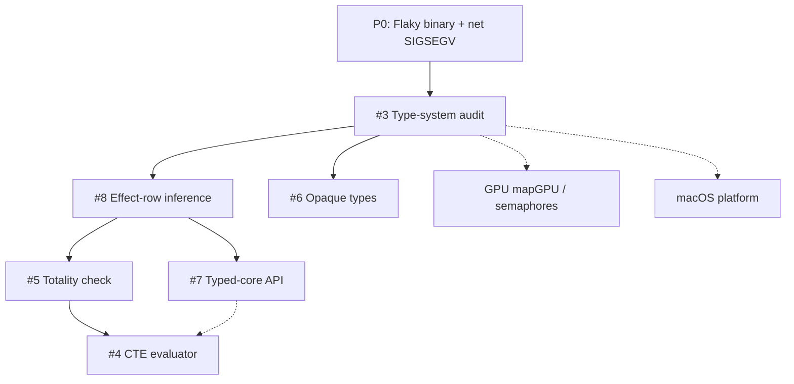

# Next Plan of Action (Aug 2026)

> **For agentic workers:** REQUIRED SUB-SKILL: Use `superpowers:subagent-driven-development` (recommended) or `superpowers:executing-plans` to implement **one phase at a time**. Each phase below should become its own detailed plan before coding when the work exceeds ~1 day. Steps use checkbox (`- [ ]`) syntax for tracking.

**Goal:** Stabilize flaky tests, produce an evidence-based type-system status matrix (GitHub #3), then execute type-system / compiler work in dependency order while keeping GPU and platform items on a parallel track that does not block correctness.

**Architecture:** Treat GitHub issues #3–#8 as the type-system program of record; treat `docs/todo-list.md` as the product/runtime program of record. Do not start compile-time evaluation (#4) or typed-core (#7) until the audit (#3) and effect-row story (#8) are honest about what already works. Fix flaky doctests before new language features so CI remains a trustworthy gate.

**Tech Stack:** Yona → LLVM 22 codegen (`yonac`), doctest, CMake presets (`x64-debug-linux` / `build-debug-linux`), GitHub issues on `yona-lang/yona`, design docs under `docs/`.

## Global Constraints

- Prefer pure Yona over C unless syscalls / layout / measured hot paths require C (`CLAUDE.md` stdlib rule).
- New language features update lexer → parser → AST → codegen together; AST changes touch `include/ast.h`, `include/ast_visitor.h`, and codegen.
- Discoveries that are bugs go into `docs/todo-list.md` with a one-line repro before continuing.
- When finishing a phase or bugfix, update this plan, `docs/todo-list.md`, and `CHANGELOG.md` in the same change. Do not leave stale checkboxes.
- Do not silently expand scope past the active phase; open a GitHub issue or todo checkbox instead.
- Build/test defaults: `cmake --preset x64-debug-linux`, `cmake --build --preset build-debug-linux`, `ctest --preset unit-tests-linux` (or `./out/build/x64-debug-linux/tests -tc=…`).

---

## Current State Snapshot (2026-08-18)

`VERSION` **0.1.3**. `master` HEAD `30f8953` (v0.1.3 tag). Linearity overlay is in the working tree (uncommitted).

### Done since this plan was written (2026-08-17)

- **Phase 0:** flaky `binary_seek` / `binary_write_read` and `net_runtime_test` TCP SIGSEGV (`d896a9e`)
- **Phase 1 / [#3](https://github.com/yona-lang/yona/issues/74):** `docs/type-system-status.md` (`d7abcba`); issue **closed** 2026-08-18. Follow-ups [#9](https://github.com/yona-lang/yona/issues/80)–[#11](https://github.com/yona-lang/yona/issues/82)
- **Track P (partial):** macOS kqueue + MoltenVK; Windows Erlang `--skip-erl` / `YONA_BENCH_SKIP_ERLANG`; tags **v0.1.1–v0.1.3** (Copr `check-rpaths` / `libyona_lib.so`, Homebrew `HOMEBREW_TAP_TOKEN` or `HOMEBREW_TAP_SSH_KEY`, in-process LLD ELF/Darwin args, system CLI11/LLD)
- **LinearityChecker (working tree, uncommitted):** no C++ producer-name allowlist; type-directed `Linear`; `.yonai` `LINEAR` overlay; `ImportExpr` / wildcard / FQN `Pkg\Mod::func` (`ModuleCall`) via `ImportTypeSource`

### Shipped earlier (still true)

- Task-group bump arenas + raise unwind (`513ff84`) and nested-fn arena IR isolation
- Windows parity, transfer-scope O(1) droppability, borrow-aware `.yonai`, `@borrow`, `-Wunmatched-adt`
- `Std\GPU` columnar API + Vulkan map/mul/reduce/filter, `--emit-accelerator-report`, crossover benches
- `extern native` + floatArrayMul2Async; channel deadlock detection

### Local open work (`docs/todo-list.md`)

| Priority band | Item | Notes |
|---|---|---|
| **P1 language** | [#8](https://github.com/yona-lang/yona/issues/79) effect-row inference + `.yonai` | **Shipped** 2026-08-19 (open-row `.yonai` + E0202 origins) |
| **P1 language** | Type-level `&T` borrows | Design: `docs/design-borrow-types.md` |
| **P1 GPU** | Track G **remaining** | Full arbitrary-lambda SPIR-V; io_uring/reactor research; occupancy hints; macOS/Windows bench re-capture. Kernel library includes `x * x` / Vulkan `filterLessThan`. `raiseGpu` GENFN path shipped. **Surface shipped**. |
| **P2 distro** | Windows installer polish; LLD default on Windows (LibXml2) | Linux/macOS in-process LLD shipped in v0.1.2 |
| **P2 formal** | Rocq Phase 0 skeleton | Parallel; does not block #8 |

### GitHub issues (opened 2026-08-17)

| # | Title | Status |
|---|---|---|
| [#3](https://github.com/yona-lang/yona/issues/74) | Type-system audit | **Closed** 2026-08-18 |
| [#8](https://github.com/yona-lang/yona/issues/79) | Effect-row inference + `.yonai` | **Closed** 2026-08-19 |
| [#6](https://github.com/yona-lang/yona/issues/77) | Opaque exported types | Open; after #3; parallel with #8 |
| [#5](https://github.com/yona-lang/yona/issues/76) | Opt-in totality + effect-freedom | Open; needs #8 |
| [#4](https://github.com/yona-lang/yona/issues/75) | Deterministic evaluator | Open; needs #5 |
| [#7](https://github.com/yona-lang/yona/issues/78) | Typed-core API | Open; arch after #3; API after #8 |



---

## Phase 0 — Stabilize CI (bugs first)

**Status (2026-08-18):** **Done.** Unique fixture object/exe paths + File `auto_await`; net SIGSEGV via shared io_uring ring (`d896a9e`). See `docs/todo-list.md` Bugs.

**Goal:** Make `ctest --preset unit-tests-linux` trustworthy on a clean Linux box.

**Files (expected touch set):**
- Modify: `test/codegen_test.cpp` (fixture runner / tmp path rewrite)
- Modify or inspect: `test/codegen/binary_seek.yona`, `test/codegen/binary_write_read.yona` (and `.expected`)
- Modify: `test/net_runtime_test.cpp` and/or `src/runtime/platform/net_linux.c` (or Windows twin if shared)
- Modify: `docs/todo-list.md` (mark fixed or refine repro)

### Task 0.1: Reproduce binary fixture flake

- [x] **Step 1: Run the fixture subcase in a loop**

```bash
cmake --build --preset build-debug-linux
for i in $(seq 1 50); do
  ./out/build/x64-debug-linux/tests -tc="*binary_seek*" || echo FAIL_seek_$i
  ./out/build/x64-debug-linux/tests -tc="*binary_write_read*" || echo FAIL_wr_$i
done
```

Expected: at least one failure showing stdout `0`, or document “no flake in 50 runs on this host” and keep the todo open with that note.

- [x] **Step 2: Isolate whether the bug is path rewrite, process cwd, or Binary stdlib**

Inspect `rewrite_codegen_fixture_tmp_paths` in `test/codegen_test.cpp` and confirm scratch files under `/tmp` are unique per run and cleaned. If two tests share a path, fix uniqueness first.

- [x] **Step 3: Fix root cause + add a focused regression**

Prefer a deterministic unit/codegen assertion over “run 50 times”. If the bug is race on shared temp, use `mkdtemp`-style unique dirs. If Binary seek/write returns wrong length, fix runtime/`Std\Binary` and add a non-flaky fixture.

- [x] **Step 4: Verify**

```bash
ctest --preset unit-tests-linux
```

Expected: 100% pass.

- [x] **Step 5: Commit** (only when user asks, or when executing this phase end-to-end)

```bash
git add test/ docs/todo-list.md src/
git commit -m "Fix flaky binary_seek / binary_write_read codegen fixtures"
```

### Task 0.2: Reproduce and fix net SIGSEGV

- [x] **Step 1: Run net tests under ASan if available, else loop**

```bash
./out/build/x64-debug-linux/tests -tc="*Runtime Net*"
# Prefer rebuilding with -fsanitize=address if the preset supports it
```

- [x] **Step 2: Identify use-after-free vs null socket vs thread teardown**

Check accept/connect/send/recv ownership in `src/runtime/platform/net_linux.c` and the test’s handle lifetime.

- [x] **Step 3: Fix + keep the existing doctest as regression**

- [x] **Step 4: Verify full suite + mark todo done**

```bash
ctest --preset unit-tests-linux
```

Update `docs/todo-list.md` Bugs section checkboxes when fixed.

---

## Phase 1 — GitHub #3: Type-system status audit

**Status (2026-08-18):** **Done.** `docs/type-system-status.md` (`d7abcba`); [#3](https://github.com/yona-lang/yona/issues/74) closed. Follow-ups #9 effect decls and #10 blocking E0500/E0600 landed; #11 finite-ADT `--Wincomplete-patterns` landed 2026-08-24.

**Goal:** Deliver `docs/type-system-status.md` so later issues do not invent features that already exist (or depend on fiction).

**Files:**
- Create: `docs/type-system-status.md`
- Modify (status headers only): `docs/effects.md`, `docs/linear-types.md`, `docs/refinement-types.md`, `docs/row-polymorphism.md`, `docs/design-borrow-types.md`, `docs/type-checker-design.md` (as present)
- Evidence from: `include/typechecker/`, `src/typechecker/`, `src/codegen/CodegenEffects.cpp`, `test/type_checker_test.cpp`

### Task 1.1: Build the matrix skeleton

- [x] **Step 1: Create the status doc with rows for each feature family**

Feature families (minimum): algebraic effects + handlers, effect rows, linear types, refinement types, row polymorphism, `@borrow` / planned `&T`, `.yonai` GENFN / borrow metadata, pattern matching exhaustiveness / `-Wunmatched-adt`.

Columns: Parser | AST | Typechecker | Codegen | `.yonai` | Tests | Classification (`implemented` / `partial` / `design-only` / `missing`).

- [x] **Step 2: For each cell, link a file path or test name**

Example evidence style (required by #3):

```markdown
| Effect handlers | implemented | `src/codegen/CodegenEffects.cpp` | `test/type_checker_test.cpp` (*handle*) |
```

- [x] **Step 3: Mark contradictions**

If a design doc claims behavior that has no test, classify as `design-only` or `partial` and note the gap.

- [x] **Step 4: Draw the dependency graph for #8 / #5 / #4 / #6 / #7**

Put it in `docs/type-system-status.md` (can mirror the mermaid above with audit findings).

- [x] **Step 5: Open follow-up GitHub issues only for newly discovered defects**

Do not implement features in this phase (#3 non-goals).

- [x] **Step 6: Close or comment on #3 with the PR/commit that adds the matrix**

Acceptance from #3: every named feature has the six status columns; design-only is explicit; follow-ups are split.

---

## Phase 2 — GitHub #8: Effect-row inference + cross-module propagation

**Status (2026-08-19):** **Shipped** (local inference, handler subtract,
pretty-print, `.yonai` `effects` including open `|rN` + per-param rows,
E0202 with perform-origin spans, HOF open-rest threading, recursion LFP).
Dedicated plan:
[`2026-08-19-effect-row-inference.md`](2026-08-19-effect-row-inference.md).

**Prerequisite:** Phase 1 complete (know what already unifies/prints).

**Goal:** Effect rows are inferred, normalized, written to `.yonai`, restored on import, and checked at call sites.

**Primary files:**
- `include/types.h`
- `include/typechecker/TypeChecker.h`, `src/typechecker/TypeChecker.cpp`
- `.yonai` writer/reader paths (module codegen / interface emit)
- `docs/effects.md`
- Tests: `test/type_checker_test.cpp` + new cross-module fixtures under `test/`

**Before coding:** write a dedicated plan `docs/superpowers/plans/YYYY-MM-DD-effect-row-inference.md` with TDD fixtures for: sequential union, handler subtraction, open rows on HOFs, deterministic row display, producer/consumer `.yonai` round-trip, negative diagnostic with source of escaping `perform`.

**Exit:** #8 acceptance criteria checked; update `docs/type-system-status.md` effect-row row to `implemented` or remaining `partial` with honest gaps.

### Slice 1 checklist (2026-08-19)

- [x] Arrow latent `effect_labels` / open `effect_rest` + `MEffectRow`
- [x] Infer: perform / handle / function / apply; pretty `!{…}`
- [x] Handler subtraction (nested / partial tested)
- [x] `.yonai` `effects` emit/parse + import → ImportedFnSig
- [x] E0202 at top-level apply of effectful callee
- [x] Docs: effects.md, type-system-status, CHANGELOG, this plan
- [x] Slice 2: HOF open-row stress, recursion LFP, tests (2026-08-19)
- [x] Full #8: open-row `.yonai` (`|rN` + `N:row` on exports), E0202 origin spans (2026-08-19)
---

## Phase 3A — GitHub #6: Opaque exported types (parallelizable with Phase 2)

**Prerequisite:** Phase 1 (audit may already show partial export visibility).

**Goal:** `export type T opaque` (exact syntax per short design note) hides constructors across modules while smart constructors work.

**Primary files:** module export AST (`include/ast.h`), parser module decls, `.yonai` type export records, pattern match / constructor resolve in typechecker + codegen, docs + cross-module tests.

**Before coding:** short design note in `docs/` covering visibility, pattern matching, traits, `.yonai`; then a dedicated implementation plan.

**Exit:** #6 acceptance criteria; migration note for currently fully-exported ADTs.

---

## Phase 3B — GitHub #5: Opt-in totality / effect-freedom

**Prerequisite:** Phase 2 (#8) so “empty effect row” is real.

**Goal:** Opt-in gate requiring closed empty effects plus exhaustive matches over
registered finite ADTs, with located diagnostics and facts in `.yonai`.

**Status (2026-08-24):** The CLI flag `--require-effect-free` now enforces
closed empty rows and finite-ADT case exhaustiveness (E0203), including module
function bodies. Termination, overlap freedom, and non-ADT coverage remain open.

**Before coding:** design doc required by #5; then implementation plan.

**Exit:** #5 acceptance; does **not** yet evaluate at compile time (#4).

---

## Phase 4 — GitHub #7 architecture + thin typed-core slice

**Status (2026-08-21):** thin slice landed on `feature/typed-core-abi`.

**Prerequisite:** Phase 1 done; Phase 2 strongly preferred so effect facts exist.

**Goal:** Versioned in-process C++ API (no LLVM headers in the consumer) + example backend that dumps resolved names/types/effects/linearity/spans.

**Order inside this phase:**
1. [x] Architecture doc (ownership, versioning, compatibility) — `docs/typed-core.md`
2. [x] Minimal traverse + textual summary example — `src/typed_core/PrettyPrint.c` + `yonac --emit-typed-core`
3. [x] Producer/consumer tests for functions, ADTs, match, effects, generics, imports — `test/typed_core_abi_test.cpp`

**Defer:** wire format serialization.

---

## Phase 5 — GitHub #4: Deterministic evaluator

**Prerequisite:** #5 (totality/purity gate) and either typed-core (#7) or a documented typechecked-AST subset.

**Goal:** Evaluate proven-pure-total expressions deterministically for static asserts / constant emission.

**Non-goals:** macros, arbitrary native at compile time.

---

## Parallel tracks (do not block Phases 0–2)

### Track G — GPU (`docs/design-gpu-async.md`, todo Std\GPU)

**Status (2026-08-19):** User-facing Track G **surface shipped** (`mapGPU` /
`reduceGPU` / float variants, `mapReduceGraphGPU`, early cancel, Vulkan-mapped
`PinnedFloats` + channels, transparent fixed-kernel lowering, typed `Gpu`
perform helpers, `--strict-accelerator` / E0700). Kernel library also lowers
`x - k` / `0 - x` / `x * x` / `x < k` (`filterLessThan` + `mapSquare` Vulkan).
`raiseGpu` GENFN + use-site `handle` is the designed library `perform` path.
**Still open** (see `docs/todo-list.md` *Language — GPU*):

1. [x] `mapGPU` / `reduceGPU` on FloatArray/IntArray (Yona surface + runtime)
2. [x] Multi-kernel timeline / `VK_KHR_synchronization2` barrier graphs; drop remaining idle waits from hot paths
3. [x] Tighter task-group cancel of in-flight GPU work
4. [x] Pinned buffers / multi-stage graphs / transparent lowering (Vulkan-mapped pins +
   `gpuFloatChannel` / `drainMapFloatGPU` + transparent IntArray/FloatArray kernel rewrite)
5. [x] Typed `Gpu` effect ops (`raiseGpu` / `withGpuFallback`; effect-row **#8** shipped 2026-08-19 including open-row `.yonai`)
6. [x] Honest rejection for arbitrary accelerator lambdas (`--strict-accelerator` / E0700)
7. [ ] Full **arbitrary-lambda → SPIR-V** compiler (today: expanded fixed library including `x * x` / `filterLessThan` Vulkan + host path or E0700)
8. [ ] Optional **io_uring / reactor GPU integration** (**research** — no concrete deliverable beyond Option C in `design-gpu-async.md` §3.2)
9. [ ] **CPU/GPU occupancy / scheduling hints** (**research** — no design deliverable yet)
10. [x] **`perform Gpu` from `Std\GPU`** — designed path: `GpuIssue` from kernels; `raiseGpu` / `withGpuFallback` GENFN remonomorphize inside user `handle` (2026-08-19). Not a runtime handler stack.
11. [ ] **macOS / Windows** GPU bench re-capture after Track G (`run_gpu_compare.py` / pinned + filter_lt + map_square rows) — Linux-only agent env; leave for host re-run

### Track P — Platform / distribution

1. [x] Document Windows Erlang OTP crash + CI skip / WSL (`--skip-erl`, `YONA_BENCH_SKIP_ERLANG`)
2. [x] macOS kqueue runtime + MoltenVK GPU portability
3. [x] v0.1.1–v0.1.3 packaging: system CLI11/LLD, Linux/macOS in-process LLD args, Copr `check-rpaths` + `libyona_lib.so`, Homebrew tap credentials
4. [ ] Windows installer polish/signing; sysroot layout pass; LLD default on Windows (LibXml2)

### Track L — Language follow-ups (after #3)

1. [ ] `&T` type-level borrows per `docs/design-borrow-types.md` (builds on shipped `@borrow`)
2. [x] LinearityChecker type-directed producers + `.yonai` `LINEAR` overlay + FQN `ModuleCall` (working tree, uncommitted)
3. [x] LinearityChecker walk `WithExpr` (`with h = Linear …` tracks + Closeable discharge)
4. [x] LinearityChecker walk `FunctionExpr` bodies (nested lambdas / local fns / Linear params)
5. [ ] Supervisors-as-handlers (after structured concurrency cancel story is frozen)
6. [ ] LSP / package manager — product call; prefer after typed-core (#7) so tools share semantic facts

---

## Recommended execution order (next 2–4 weeks)

W1 (Phase 0) and W1–W2 (Phase 1 / #3) are **done** as of 2026-08-18.

| Week | Focus | Done when |
|---|---|---|
| **W1** | Phase 0 bugs | **Done** — flaky binary + net SIGSEGV fixed (`d896a9e`) |
| **W1–W2** | Phase 1 (#3) | **Done** — `docs/type-system-status.md`; #3 closed |
| **W2–W3** | Phase 2 (#8) **or** Track G remaining research | Effect rows round-trip **or** SPIR-V / platform bench re-capture |
| **W3–W4** | Phase 3A (#6) and/or Phase 3B (#5) design | Opaque types shipping **or** totality design + first checker |

**Default recommendation if only one series can run:**  
`Phase 2 (#8) → Phase 3B (#5) → Phase 4 (#7) → Phase 5 (#4)`, with **Track G
remaining** (SPIR-V / research / platform re-capture) on a second lane.
Linearity leftovers (`WithExpr` / `FunctionExpr`) can land beside #8.

---

## Self-review

1. **Spec coverage:** Local todo P0 bugs, Active Priorities, Suggested next steps, and all six GitHub issues appear in a phase or parallel track.
2. **Placeholder scan:** Later phases require a dedicated plan file before coding rather than vague “implement later” steps inside this roadmap.
3. **Dependency consistency:** #4 after #5; #5 after #8; #7 after #3/#8; #6 after #3 only.

---

## Execution handoff

Plan saved to `docs/superpowers/plans/2026-08-17-next-plan-of-action.md`.

**Next:** [#5](https://github.com/yona-lang/yona/issues/76) remaining totality
work (termination, overlap, and non-ADT coverage) or `Linear FileHandle` for
real; Track G remaining is full arbitrary-lambda SPIR-V / research /
macOS-Windows bench re-capture.

[#10](https://github.com/yona-lang/yona/issues/81) (blocking E0500/E0600,
E0602 leaks, checkers on modules) landed 2026-08-24.

Linearity `WithExpr` / `FunctionExpr` walks and the kernel-library increment
(`x - k` / `x < k`) landed 2026-08-19 beside Track G. Effect-row #8 (including
open-row `.yonai` and E0202 origins) landed the same day.
