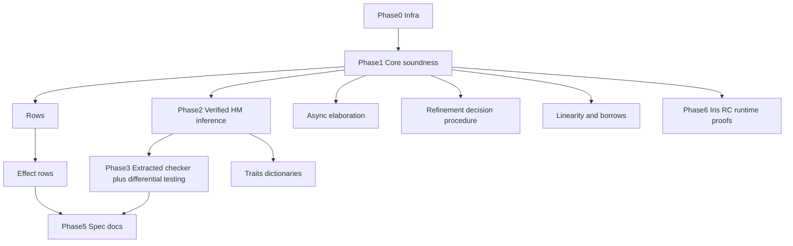

# Yona Formal Specification in Rocq — Master Plan

> **For agentic workers:** REQUIRED SUB-SKILL: Use `superpowers:subagent-driven-development` (recommended) or `superpowers:executing-plans` to implement **one phase at a time**. Each phase below should become its own detailed plan before coding when the work exceeds ~1 day. Steps use checkbox (`- [ ]`) syntax for tracking.

**Goal:** A machine-checked formal specification of Yona in the Rocq prover: a core calculus with soundness proofs, a verified executable type checker extracted to OCaml and differentially tested against the C++ compiler, then staged extensions (rows, effects, traits, refinements, linearity) up to a research-grade verified runtime memory model.

**Architecture:** Every typing rule exists as a Rocq inductive definition. The metatheory (progress, preservation, principal types) is machine-checked. A verified reference type checker extracted from Rocq validates the same programs the C++ compiler accepts. The formal spec becomes the language contract; the C++ implementation becomes an optimized replica of it.

**Tech Stack:** Rocq 9.2, stdpp, Autosubst 2, QuickChick, MetaRocq verified extraction, Iris (phase 6), Alectryon/coqdoc. Cross-links: [todo-list.md](../../todo-list.md) §4 and § Formal specification; GitHub issues [#3](https://github.com/yona-lang/yonac-llvm/issues/3)–[#8](https://github.com/yona-lang/yonac-llvm/issues/8).

## Global Constraints

- Formalize only what the compiler actually implements, or mark design-only features as such (feeds issue #3).
- Phases 0–3 are the committed backbone. Phase 4 modules are parallelizable after the audit. Phase 6 is opt-in research.
- Each phase gets its own detailed task-level plan under `docs/superpowers/plans/` before coding.
- Do not silently expand the C++ type checker to match an unproven spec; disagreements go into `docs/todo-list.md` with a one-line repro.

---

## Why this shape

- The implemented checker is HM + ADTs + rows + effect rows + traits + refinements + linearity ([include/typechecker/InferType.h](../../../include/typechecker/InferType.h), [docs/type-checker-design.md](../../type-checker-design.md)). Several features are partially implemented (GitHub [#3](https://github.com/yona-lang/yonac-llvm/issues/3) audit). Formalizing forces the honest answer #3 asks for.
- The typed-core interface (GitHub [#7](https://github.com/yona-lang/yonac-llvm/issues/7)) is the bridge for differential testing: the compiler dumps typed judgments, the extracted verified checker re-validates them.
- Yona's refinement language ([docs/refinement-types.md](../../refinement-types.md), `RefinePredicate` in [include/types.h](../../../include/types.h)) is deliberately finite (literal comparisons + boolean combinators + `LengthGt`) — decidable without SMT, so a fully verified refinement checker is achievable.

## Toolchain

- **Rocq 9.2** (opam, dune build) — the prover itself.
- **stdpp** — modern stdlib (gmaps, tactics); prerequisite for Iris later.
- **De Bruijn indices via Autosubst 2** for binding (generates substitution lemmas mechanically).
- **QuickChick** — property-based testing of the spec (generate random well-typed terms, check the checker) before proofs are done.
- **MetaRocq verified extraction** to OCaml — the extracted checker carries correctness down to executable code (standard extraction as fallback).
- **Iris** (phase 6) — separation logic for the Perceus reference-counting runtime proofs.
- **Alectryon/coqdoc** — render typing rules as HTML into `docs/formal/`.

## Repository layout

```
formal/
  dune-project, rocq-yona.opam      # deps: rocq 9.2, stdpp, autosubst, quickchick
  theories/
    Core/     Syntax.v Types.v Typing.v Semantics.v Soundness.v
    Infer/    Unify.v AlgorithmW.v Soundness.v Completeness.v Principal.v
    Ext/      Rows.v Effects.v Async.v Traits.v Refine.v Linear.v
    Runtime/  Heap.v RC.v PerceusIris.v          # phase 6
  extraction/ Extract.v ocaml/       # extracted checker + CLI wrapper
  test/       differential/          # harness: yonac dump vs verified checker
```

## Phases

### Phase 0 — Infrastructure

- [ ] `formal/` dune+opam skeleton, pinned Rocq 9.2 toolchain, GitHub Actions job (opam cache) so `dune build formal` gates CI like `tests` does.
- [ ] `docs/formal-spec.md`: scope statement, naming conventions, feature status table (feeds issue #3).

### Phase 1 — Yona-Core v0: calculus + soundness

The kernel every later feature builds on. Features: Int/Float/Bool/String/Symbol/Unit, lambdas + application (curried, CBV), `let`, tuples, `Seq`, ADT declarations + constructors, `case` with nested patterns, general recursion.

- [ ] `Syntax.v` / `Types.v`: terms and monotypes mirroring `MonoType` (Var/Con/App/Arrow/MTuple).
- [ ] `Semantics.v`: small-step CBV operational semantics; pattern matching as a total `match_pattern : pattern -> value -> option env`.
- [ ] `Typing.v`: declarative judgment `Γ ⊢ e : τ`.
- [ ] Theorems: progress + preservation (type soundness), exhaustiveness lemma for ADT case.

### Phase 2 — HM inference, verified

- [ ] Verified unification (termination via well-founded measure) and Algorithm W with let-generalization/levels, matching [docs/type-checker-design.md](../../type-checker-design.md).
- [ ] Theorems: soundness (inferred ⇒ derivable), completeness + principal types (any derivable type is an instance of the inferred one).

### Phase 3 — Executable verified checker + differential testing

- [ ] `infer : env -> term -> option scheme` extracted to OCaml (MetaRocq verified extraction).
- [ ] Compiler side: `yonac --emit-typed-core` JSON dump of resolved AST + inferred types for the core fragment — seed of issue [#7](https://github.com/yona-lang/yonac-llvm/issues/7).
- [ ] Harness runs every `test/codegen/*.yona` fixture through both checkers; disagreement = bug in one of them. QuickChick fuzzes random terms for agreement.

### Phase 4 — Type-system extensions (one module each)

1. [ ] **Rows.v** — records + row polymorphism (open rows with row variables, as in `MRecord`); extend unification proofs.
2. [ ] **Effects.v** — effect rows + algebraic effect handlers; operational semantics with `perform`/`handle` (frame-stack style); theorem: well-typed programs with empty effect row never get stuck on an unhandled effect. Informs issue [#8](https://github.com/yona-lang/yonac-llvm/issues/8) and totality (#5).
3. [ ] **Async.v** — `Promise τ` + transparent await as type-directed elaboration into explicit-await core; theorem: elaboration is type-preserving.
4. [ ] **Traits.v** — trait constraints elaborated to dictionary passing; coherence theorem (elaboration result independent of derivation).
5. [ ] **Refine.v** — the finite predicate language; verified decision procedure for entailment (interval + boolean reasoning — no SMT); theorem: `E0500`-style checks are sound.
6. [ ] **Linear.v** — substructural judgment for `Linear a` consume-exactly-once + borrow annotations ([docs/design-borrow-types.md](../../design-borrow-types.md)); theorem: no use-after-consume, no leak at scope exit.

### Phase 5 — Spec as living documentation

- [ ] Alectryon-rendered typing rules published to `docs/formal/`; `scripts/gendocs.py` hook.
- [ ] Each `docs/*.md` feature doc gains a status header: "formalized in `formal/theories/...`, theorem X" — completing the honesty pass of issue #3.

### Phase 6 — Verified runtime memory model

- [ ] `Runtime/`: heap semantics with reference counts; model the Perceus callee-owns ABI ([docs/memory-management.md](../../memory-management.md)).
- [ ] Iris proofs: RC-insertion preserves program semantics; no leaks, no use-after-free, unique-owner in-place reuse is safe.

## Dependency graph



## Sequencing

Phases 0–3 are the committed backbone (each independently valuable). Phase 4 modules are parallelizable and can be reprioritized as the #3 audit clarifies which features are real. Phase 6 is opt-in ambition.

Compiler type-system work (#3 → #8 → #5 → #7 → #4) stays on its own track; the formalization consumes honest status from #3 and later supplies a verified checker for the #7 typed-core dump. See [todo-list.md](../../todo-list.md) §4.
