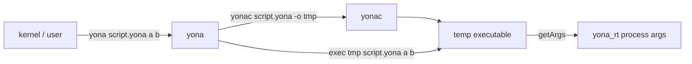

# Yona Shebang Scripts and getArgs Implementation Plan

> **Superseded 2026-08-20.** The runner is written in Yona (`tools/yona/main.yona`),
> `yonac -e` was removed in favor of `yona -e` and `yonac -`, and the C++ REPL
> is `yona-repl`.
>
> **Windows CI (2026-08-20):** MSVC `popen`/`cmd /c` quote stripping broke
> `yona`/`yonac` script doctests; `wrap_for_cmd_c` and `PATH` (not `HOME`)
> in `stdlib_process` landed on master.

> **For agentic workers:** REQUIRED SUB-SKILL: Use superpowers:subagent-driven-development (recommended) or superpowers:executing-plans to implement this plan task-by-task. Steps use checkbox (`- [ ]`) syntax for tracking.

**Goal:** Teach the packaged `yona` binary to compile-and-run a file so `#!/usr/bin/env yona` works after brew/dnf/apt install, and add `Std\Process.getArgs` so both shebang scripts and AOT binaries can read CLI arguments.

**Architecture:** `yona` drives the sibling `yonac` to a temp executable, then execs it with rewritten `argv` so `getArgs` sees the script path rather than the temp file. Generated `main` becomes `main(argc, argv)` and stores args in the runtime.

**Tech Stack:** `yonac` / `yona` CLIs, LLVM codegen (`codegen_main`), `compiled_runtime.c`, `Std\Process.yonai`, doctest + codegen fixtures.

## Global Constraints

- Distro and Homebrew packages already install `yona` and `yonac` to `bindir`; do not change packaging file lists or formulas.
- Discover `yonac` next to the `yona` executable; never hardcode `/usr/bin`, `/opt/homebrew`, or `/usr/local`.
- Shebang is already a `#` line comment in the lexer; do not add a special shebang token.
- Out of scope: compile-result cache, `yonac --run`, Windows shebang, `getArgs` excluding `argv[0]`, a Yona package manager, `yona -e`, shebang-line `-I` flags (`YONA_PATH` already works).

---

## Why this works in packages already

Homebrew / Copr / AUR / PPA already install `yona` and `yonac` to `bindir` (`dist/copr/yona.spec` lines 51–52). `#!/usr/bin/env yona` will find the binary. The lexer already treats `#` as a line comment (`src/Lexer.cpp` ~246), so a shebang is ignored as source. Two gaps remain:

1. `repl/main.cpp` ignores `argv[1]` and always starts the REPL.
2. Generated `main` is `() -> i32` (`src/Codegen.cpp` `codegen_main`) and `Std\Process` has no `getArgs` (`lib/Std/Process.yonai`).

## Approaches (recommendation: A)

- **A (recommended) — `yona` drives sibling `yonac`, then execs a temp binary.** Same typecheck/module search as `yonac file.yona`. Shebang stays `#!/usr/bin/env yona` (Yona 1 UX). Packages already ship both binaries side by side.
- **B — Compile in-process in `yona`.** Duplicates the yonac pipeline (or ships scripts without typecheck; the REPL path currently skips it). Larger, easier to drift.
- **C — `yonac --run` and `#!/usr/bin/env -S yonac --run`.** Works, but `-S` is less familiar and the requested example is `env yona`.



## Driver: `yona` script mode

In `repl/main.cpp`, after sysroot/runtime setup:

- No file argument: existing REPL.
- `--help` / `--version`: print and exit (version from `include/version.h`, same string as `yonac`).
- First argument does not start with `-`: script mode.
- Unknown flag: error (do not fall into REPL).

Script mode:

1. Read the file; if missing, error.
2. Reject modules with the same skip-`#`-comments rule as `is_module_source` in `cli/main.cpp` (`#!/usr/bin/env yona` is a `#` comment, so it does not hide a following `module`). Message: script must be an expression program.
3. Resolve `yonac` next to this executable (same discovery style as `discover_executable_dir` in `src/LinkerPlan.cpp`).
4. Compile to a unique temp path under `TMPDIR`/`TEMP` (`yonac <script> -o <tmp>`). Inherit yonac stdout/stderr. If yonac fails, exit with its status and do not run.
5. Run the temp binary with **rewritten argv**: `argv[0] = script path`, then the user’s remaining args. Inherit stdin/stdout/stderr (unlike the REPL’s `popen` capture). Wait, unlink the temp, exit with the child’s status.

Windows: `yona script.yona args` works; shebang is Unix-only. Document that.

Each invocation compiles. Docs should say: for tools you run often, `yonac -o tool tool.yona`.

## Runtime: `getArgs`

Change `Codegen::codegen_main` to emit `main(i32 argc, i8** argv)` and call a new runtime hook at entry, e.g. `yona_rt_set_process_args(argc, argv)`.

In `src/compiled_runtime.c` (next to other `Std\Process` wrappers):

- Store `argc`/`argv` (pointers are enough; process lifetime).
- `yona_Std_Process__getArgs` builds a seq of rc-allocated strings (`yona_rt_rc_alloc_string` + `yona_rt_seq_alloc` / `yona_rt_seq_set` / `yona_rt_seq_set_heap(1)`), same pattern as directory listings.
- Missing init (should not happen): empty seq.

Register in `lib/Std/Process.yonai`:

```
FN yona_Std_Process__getArgs 0 -> SEQ
```

Semantics (both shebang and AOT): `getArgs` is POSIX `argv` — `[program_or_script, arg1, …]`. After `yonac -o hello && ./hello a b`, first element is `./hello`. After `yona script.yona a b` or `./script a b`, first element is the script path (the driver rewrites argv so it is not the temp exe).

## Tests

- **Shebang is source-legal:** new fixture `test/codegen/shebang_comment.yona` starting with `#!/usr/bin/env yona` whose body prints a constant. The existing codegen walker already compiles fixtures in-process.
- **`getArgs` on an AOT binary:** extend `test/yona_link_util.hpp` with `popen_read_all(exe, extra_args)` (or a dedicated helper). New doctest (or fixture + custom runner) compiles a program that prints `getArgs` and runs it with `foo` `bar`. Assert the tail is `foo`/`bar` and length is 3. Do not assert the exact `argv[0]` path (scratch dir differs).
- **`yona` script mode:** new `test/yona_script_test.cpp` that locates `yona` next to the `tests` binary. Cases: run a temp `.yona` that prints a literal; run one that prints `getArgs` with extra args; reject a `module` file; missing file is non-zero. Skip the Unix `chmod +x` + `./script` shebang exec if CI should stay simple — `yona file args` is the same code path the kernel uses.

## Docs (same change as the implementation)

- `CHANGELOG.md` Unreleased: script mode + `getArgs`.
- `site/src/content/docs/reference/cli.md`: `yona [script.yona [args…]]`; shebang example.
- `site/src/content/docs/learn/quick-start.md` and `site/src/content/docs/install.md`: executable scripts after package install.
- `site/src/content/docs/learn/syntax.md` and `site/src/content/docs/reference/specification.md`: one line that a leading `#!…` is a `#` comment, so shebangs are legal.
- `docs/api/Process.md` (`Process` is C + `.yonai`, not a `.yona` — update the API page by hand; then `cd site && pnpm sync` if the stdlib page is generated from it).
- `docs/todo-list.md`: this plan is already linked; mark the checkbox when the work lands.

### Task 1: Runtime getArgs

- [ ] Emit `main(argc, argv)`, store args, add `yona_Std_Process__getArgs` + `Process.yonai` FN

### Task 2: getArgs and shebang-as-comment tests

- [ ] `popen` helper + doctest/fixture: `getArgs` tail is user args; shebang-as-comment fixture

### Task 3: yona script mode

- [ ] `yona file [args]`: reject modules, sibling `yonac` to temp, exec with rewritten argv, inherit stdio

### Task 4: yona script-mode tests

- [ ] `test/yona_script_test.cpp`: run file, `getArgs`, reject module, missing file

### Task 5: Docs

- [ ] CHANGELOG, CLI/quick-start/install/syntax/spec, Process.md; mark the todo-list checkbox done
