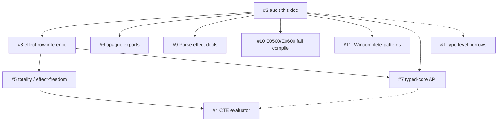

# Type-system status (audit)

Evidence-based matrix for GitHub
[#3](https://github.com/yona-lang/yonac-llvm/issues/3).
Design docs are **not** treated as implementation evidence.
Classifications: `implemented` | `partial` | `design-only` | `missing`.

Pipeline (expression programs): parse → `TypeChecker` → **non-blocking**
`RefinementChecker` + `LinearityChecker` → codegen
([`cli/main.cpp`](../cli/main.cpp)).
**Module compile skips both post-HM checkers.**

Date: 2026-08-18. HEAD at audit: `b5076e3` plus this document.
Linear `.yonai` overlay and type-directed producers: working tree
(uncommitted as of 2026-08-18).

---

## Summary matrix

| Feature | Parser | AST | Typechecker | Codegen | `.yonai` | Tests | Overall |
|---------|--------|-----|-------------|---------|----------|-------|---------|
| Algebraic effects (`perform` / `handle`) | partial | partial | partial | partial | partial | partial | **partial** |
| Effect rows (inference, union, `.yonai`) | missing | missing | implemented | n/a | implemented | implemented | **implemented** |
| Record row polymorphism | implemented | implemented | implemented | implemented | partial | implemented | **implemented** |
| Linear types (`Linear a`) | implemented | implemented | partial | implemented | partial | partial | **partial** |
| Refinement types / E0500 | implemented | implemented | partial | implemented | missing | partial | **partial** |
| `@borrow` | implemented | implemented | implemented | implemented | implemented | implemented | **implemented** |
| Type-level `&T` / lifetimes | missing | missing | missing | missing | missing | missing | **design-only** |
| GENFN + borrow bitmask | n/a | implemented | missing | implemented | implemented | implemented | **implemented** |
| `-Wunmatched-adt` | n/a | n/a | implemented | n/a | n/a | implemented | **implemented** |
| Case exhaustiveness (`-Wincomplete-patterns`) | n/a | n/a | missing | partial | missing | missing | **partial** |

`MonoType` tags are `Var | Con | App | Arrow | MTuple | MRecord | MEffectRow`
([`include/typechecker/InferType.h`](../include/typechecker/InferType.h)).
`Arrow` carries latent `effect_labels` + optional open `effect_rest`.
`MEffectRow` binds open rests during unification. Record `MRecord.row_rest`
remains **record** rows, not effect rows.

---

## 1. Algebraic effects + handlers — **partial**

Shallow in-scope handler dispatch. Not CPS. Not on function types.

| Layer | Status | Evidence |
|-------|--------|----------|
| Parser | partial | `YPERFORM` / `YHANDLE` ([`src/Lexer.cpp`](../src/Lexer.cpp)); `parse_perform_expr` / `parse_handle_expr` ([`src/parser/ParserExpr.cpp`](../src/parser/ParserExpr.cpp)). Token `YEFFECT` is **never consumed**. No `effect Name … end` / `export effect`. |
| AST | partial | `PerformExpr`, `HandleExpr`, `HandlerClause`, unused `EffectDeclNode` ([`include/ast.h`](../include/ast.h)). Parser never builds `EffectDeclNode`. |
| Typechecker | partial | `register_effect` / `infer_perform` / `infer_handle` ([`src/typechecker/TypeChecker.cpp`](../src/typechecker/TypeChecker.cpp)). Unhandled `perform` → warning `-Wunhandled-effect`, not an error. Unknown ops → fresh type var, **no error**. `register_effect` is called from **tests**, not from a parsed `effect` decl. Function arrows carry latent effect rows (#8). |
| Codegen | partial | [`src/codegen/CodegenEffects.cpp`](../src/codegen/CodegenEffects.cpp): lookup `handler_stack_`; resume is identity `i64(i64)`, not a captured continuation. Unhandled `perform` is a string error, not `E0200`. Result typed `CType::INT`. |
| `.yonai` | partial | Effect **rows** on FN lines (`effects …`, including open `|rN`); no `EFFECT` keyword / op registry export yet. |
| Tests | partial | Typechecker cases below; fixtures `test/codegen/effect_*.yona`; effect-row cases. |

**Positive:** `test/codegen/effect_simple_get.yona` → `42`

```yona
handle perform State.get () with
    State.get () resume -> resume 42
    return val -> val
end
```

**Negative:** `TEST_CASE("Effect: perform arg type mismatch is an error")`
in [`test/type_checker_test.cpp`](../test/type_checker_test.cpp)
(`perform State.put "hello"` vs `put : Int -> ()`).
Unhandled perform: `TEST_CASE("Effect: unhandled perform produces warning")`.

**Typechecker tests:** `Effect: perform with registered effect returns correct type`;
`unhandled perform produces warning`; `perform arg type mismatch is an error`;
`handle with return clause transforms result`; `no error for handled perform`.

**Codegen fixtures:** `effect_simple_get`, `effect_let_perform`, `effect_nested`,
`effect_with_arg`, `effect_return_handler`.

**Stale docs:** [`docs/effects.md`](effects.md) claims compile-time CPS and
`export effect` / `import effect`. Neither exists. Effect type parameters are
discarded (`(void)type_param` in `register_effect`).

**Follow-up:** parse `effect` decls ([#9](https://github.com/yona-lang/yonac-llvm/issues/9)); rows are [#8](https://github.com/yona-lang/yonac-llvm/issues/8) (shipped).

---

## 2. Effect rows — **implemented** for #8 (2026-08-19); totality still #5

| Layer | Status | Evidence |
|-------|--------|----------|
| Representation | implemented | `Arrow.effect_labels` / `effect_rest` / `effect_origins`, `MEffectRow` + extra rests in `args` ([`InferType.h`](../include/typechecker/InferType.h)); helpers in [`EffectRow.cpp`](../src/typechecker/EffectRow.cpp) |
| Typechecker | implemented | Ambient escaping row + open rests; perform add; handle subtract; apply join + **E0202** at introducing `perform` (call-site note); HOF rest threading; recursion LFP ([`TypeChecker.cpp`](../src/typechecker/TypeChecker.cpp), [`Unification.cpp`](../src/typechecker/Unification.cpp)) |
| Pretty-print | implemented | `(a -> !{State.get} b)`; open `!{…\|r}` |
| `.yonai` | implemented | `effects Op1,Op2` and open `effects \|r0 0:\|r0`; `ImportedFnSig.effect_spec` |
| Tests | implemented | `Effect row:*` / `Unifier: effect-row occurs *` in [`type_checker_test.cpp`](../test/type_checker_test.cpp); `Interface files preserve effect-row metadata`; `Interface files preserve open effect-row rest on HOF exports` |

**Not #8:** empty-row as totality fact (#5), parsed `effect` decls (#9).

[`docs/row-polymorphism.md`](row-polymorphism.md) is still **record** field rows only.
---

## 3. Record row polymorphism — **implemented**

| Layer | Status | Evidence |
|-------|--------|----------|
| Parser | implemented | Record literals / types ([`docs/row-polymorphism.md`](row-polymorphism.md), parser type/expr paths) |
| AST | implemented | Record expr + `MRecord` |
| Typechecker | implemented | `MRecord` + `row_rest` unify ([`src/typechecker/Unification.cpp`](../src/typechecker/Unification.cpp)) |
| Codegen | implemented | Record construction / field access |
| `.yonai` | partial | Function types do not print open row variables; records work as values |
| Tests | implemented | Record cases in `test/type_checker_test.cpp` / codegen record fixtures |

**Positive:** `{ name = "Alice", age = 30 }` field access (docs + tests).
**Negative:** missing-field / type mismatch on records in the typechecker suite.

This is **not** [#8](https://github.com/yona-lang/yonac-llvm/issues/8).

---

## 4. Linear types — **partial**

`Linear` is a Prelude ADT (`lib/Prelude.yona`), not an HM type.

| Layer | Status | Evidence |
|-------|--------|----------|
| Parser | implemented | Ordinary constructor `Linear` |
| AST | implemented | ADT, no linear node |
| Typechecker | partial | [`src/typechecker/LinearityChecker.cpp`](../src/typechecker/LinearityChecker.cpp). Type-directed (`Linear _` / products); no C++ producer-name allowlist. `ImportTypeSource` for selective import, wildcard, and FQN `Pkg\Mod::func` (`ModuleCall`). Walks `WithExpr` (Closeable discharge) and `FunctionExpr` bodies (fresh scope; Linear params from zonked arrow type). **Skipped on modules.** CLI does **not** abort on E0600/E0601. |
| Codegen | implemented | RC ADT, no linear IR |
| `.yonai` | partial | `LINEAR` overlay on FN/IO/AFN rows ([`src/codegen/CodegenModule.cpp`](../src/codegen/CodegenModule.cpp)); CType stays INT/TUPLE. No consume-site / obligation metadata. |
| Tests | partial | Unit tests below; import leak cases (`openFile`, `channel`); codegen `closure_captures_linear.yona` |

**Diagnostics:** **E0600** use-after-consume; **E0601** branch inconsistency
(defined, tested as strings); **E0602** explained but **never emitted** —
leaks use **`-Wunhandled-effect`**.

**Positive:** `TEST_CASE("LinearEnv: create and consume")`;
`LinearityChecker: transfer via alias is OK`;
`LinearityChecker: imported openFile creates obligation`;
`LinearityChecker: with body unconsumed Linear warns`;
`LinearityChecker: FunctionExpr body unconsumed Linear warns`.
**Negative:** `LinearityChecker: use after consume is error` (E0600).
**Note:** `with h = Linear … in …` tracks the binding and discharges it at
with-exit (Closeable); nested leaks inside the body still warn.

**Stale (audit-day):** [`docs/linear-types.md`](linear-types.md) implied E0602
fires and that linear values cannot be captured in closures; the capture
fixture compiles. Producer-name allowlist language is **updated** (2026-08-18).

---

## 5. Refinement types — **partial**

| Layer | Status | Evidence |
|-------|--------|----------|
| Parser | implemented | `{ var : T \| pred }` ([`src/parser/ParserType.cpp`](../src/parser/ParserType.cpp)) |
| AST | implemented | `RefinedType` / `RefinePredicate` ([`include/types.h`](../include/types.h)) |
| Typechecker | partial | [`src/typechecker/RefinementChecker.cpp`](../src/typechecker/RefinementChecker.cpp) only. No `MonoType` refinement. Aliases `NonEmpty` / `Port` / `NonZero` parse; **not** enforced at signatures. `register_refined_type` unused by CLI. Intra-function default walk skipped. **Non-blocking; skipped on modules.** |
| Codegen | implemented | Erase to base type ([`src/Codegen.cpp`](../src/Codegen.cpp)) |
| `.yonai` | missing | No predicates |
| Tests | partial | Unit E0500 tests; codegen `seq_head_tail.yona` is **runtime**, not a `yonac` failure |

**Diagnostics:** **E0500** for `head`/`tail`/`seq_first`/`seq_last` on unproven
nonempty seqs; nonzero `/` on `AST_DIVIDE_EXPR`.

**Positive:** `head on non-empty seq is OK`; `head after [h|t]`;
`cons proves non-empty`; `division by literal non-zero`.
**Negative:** `head on unknown seq` (E0500); `division by unknown` / `division by zero literal`.

**Stale:** [`docs/refinement-types.md`](refinement-types.md) presents
`head : NonEmpty a -> a` as compiler-checked. It is not.

---

## 6. `@borrow` — **implemented**; `&T` — **design-only**

| Layer | `@borrow` | `&T` / lifetimes / borrowed fields |
|-------|-----------|-------------------------------------|
| Parser | implemented (`@borrow` on params) | missing (`&` is `&&` / `YAND`) |
| AST | `FunctionExpr::param_borrow` | no `MBorrow` |
| Typechecker | **E0603** ([`src/typechecker/TypeChecker.cpp`](../src/typechecker/TypeChecker.cpp) `check_param_borrow_annotations`; escape via [`BorrowEscapeAnalysis`](../include/analysis/BorrowEscapeAnalysis.h)) | missing |
| Codegen | Same skip-DUP as inference ([`src/codegen/CodegenExpr.cpp`](../src/codegen/CodegenExpr.cpp)) | design-only |
| `.yonai` | `borrow 01…` bitmask ([`src/codegen/CodegenModule.cpp`](../src/codegen/CodegenModule.cpp)) | no `&` in printed types |
| Tests | implemented | none |

**Positive:** `TEST_CASE("@borrow accepted when parameter is only read")`;
codegen `borrow_closure_param.yona`, `borrow_foldl_closure.yona`;
`Interface files preserve inferred borrow metadata` (expects `borrow 1`).
**Negative:** `@borrow rejected when parameter is returned`;
`@borrow rejected on non-identifier pattern` (E0603).

**Stale:** [`docs/design-borrow-types.md`](design-borrow-types.md) §1 says
neither `@borrow` nor inference appears in `.yonai`. **Bitmasks are emitted.**
`&T` itself remains unimplemented ([todo-list](todo-list.md) *Type-level borrows*).

---

## 7. GENFN + borrow metadata — **implemented**

Cross-module monomorphization source plus inferred borrow **bitmask** on `FN`
lines. HM does not reconstruct `&T` from `.yonai`.

**Positive:** `Interface files preserve inferred borrow metadata`
([`test/codegen_test.cpp`](../test/codegen_test.cpp)); GENFN round-trip in
[`test/trait_test.cpp`](../test/trait_test.cpp).
**Negative:** none required beyond missing `&` syntax (design-only).

---

## 8. Unmatched ADT vs case exhaustiveness

**`-Wunmatched-adt` — implemented.** Discarded `Option`/`Result`/other ADTs
in non-final `do` steps and `let _ = …`
([`RefinementChecker.cpp`](../src/typechecker/RefinementChecker.cpp)).
`-Wall` enables it.

**Positive:** `let r = Option does not warn`.
**Negative:** `discarded Option in do warns`; `let _ = Option warns`.

**Case exhaustiveness — partial.** Codegen prints `non-exhaustive…` on
`std::cerr` ([`src/codegen/CodegenCase.cpp`](../src/codegen/CodegenCase.cpp));
not `DiagnosticEngine`. Flags **`-Wincomplete-patterns`** and
**`-Woverlapping-patterns`** are listed for `-Wall` and **never emitted**.

**Stale:** [`docs/pattern-matching.md`](pattern-matching.md) and
[`docs/error-codes.md`](error-codes.md) describe `-Wincomplete-patterns` for
missing constructors.

---

## Known limitations (not new features)

- Linear / refinement diagnostics do not fail `yonac` (post-HM, non-blocking).
- Module path never runs those checkers.
- Effect ops used in production source are untyped except by handler clauses /
  test registration.
- `perform` result is codegen’d as `Int`.
- Resume does not abort the rest of the computation when unused.

---

## Contradictions vs design docs

| Doc | Claim | Reality |
|-----|--------|---------|
| [effects.md](effects.md) | CPS transformation; `export effect` | Identity resume; no `effect` parse |
| [type-checker-design.md](type-checker-design.md) | Effects `[done]` | No rows; no `effect` decl in grammar |
| [row-polymorphism.md](row-polymorphism.md) | (if read as effect rows) | Record rows only |
| [linear-types.md](linear-types.md) | E0602; no linear closures | E0602 unused; capture fixture exists. Producer allowlist is gone (type-directed + `.yonai` `LINEAR`). `with` still untracked. |
| [refinement-types.md](refinement-types.md) | Signature aliases checked | Syntax only |
| [design-borrow-types.md](design-borrow-types.md) | Nothing in `.yonai` | `borrow` bitmask exists |
| [pattern-matching.md](pattern-matching.md) | `-Wincomplete-patterns` | Never emitted |

---

## Dependency graph for follow-up



| Work | Issue / note | Independent? |
|------|----------------|--------------|
| Effect-row inference + `.yonai` | [#8](https://github.com/yona-lang/yonac-llvm/issues/8) | After this audit |
| Opaque exported types | [#6](https://github.com/yona-lang/yonac-llvm/issues/6) | After audit; parallel with #8 |
| Totality / empty row | [#5](https://github.com/yona-lang/yonac-llvm/issues/5) | After #8 |
| Typed-core | [#7](https://github.com/yona-lang/yonac-llvm/issues/7) | Arch after audit; API after #8 |
| CTE | [#4](https://github.com/yona-lang/yonac-llvm/issues/4) | After #5 |
| Parse `effect` decls + register ops | [#9](https://github.com/yona-lang/yonac-llvm/issues/9) | Yes (does not replace #8) |
| Blocking E0500/E0600; emit E0602; run checkers on modules | [#10](https://github.com/yona-lang/yonac-llvm/issues/10) | Yes |
| Diagnostic case exhaustiveness | [#11](https://github.com/yona-lang/yonac-llvm/issues/11) | Yes |
| `&T` | [todo-list](todo-list.md); [design-borrow-types.md](design-borrow-types.md) | After audit; large |

Default compiler series remains `#3 → #8 → #5 → #7 → #4`.
