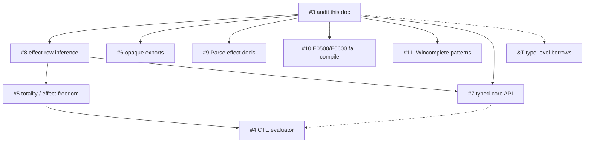

# Type-system status (audit)

Evidence-based matrix for GitHub
[#3](https://github.com/yona-lang/yona/issues/74).
Design docs are **not** treated as implementation evidence.
Classifications: `implemented` | `partial` | `design-only` | `missing`.

Pipeline (expression programs **and** modules): parse → `TypeChecker` →
**blocking** `RefinementChecker` + `LinearityChecker` → codegen
([`cli/Main.cpp`](../cli/Main.cpp)). `--Wno-refinement` / `--Wno-linear`
skip those overlays. Leaks are **E0602** (`-Wlinear-leak`, default on).

Date: 2026-08-27. HEAD at audit: current working tree plus this document.

---

## Summary matrix

| Feature | Parser | AST | Typechecker | Codegen | `.yonai` | Tests | Overall |
|---------|--------|-----|-------------|---------|----------|-------|---------|
| Algebraic effects (`perform` / `handle`) | partial | partial | partial | partial | partial | partial | **partial** |
| Effect rows (inference, union, `.yonai`) | inferred | implicit | implemented | partial | implemented | implemented | **partial** |
| Record row polymorphism | implemented | implemented | implemented | implemented | partial | implemented | **implemented** |
| Linear types (`Linear a`) | implemented | implemented | partial | implemented | missing | implemented | **partial** |
| Refinement types / E0500 | implemented | implemented | partial | implemented | missing | implemented | **partial** |
| `@borrow` | implemented | implemented | implemented | implemented | implemented | implemented | **implemented** |
| Type-level `&T` / lifetimes | missing | missing | missing | missing | missing | missing | **design-only** |
| GENFN + borrow bitmask | n/a | implemented | missing | implemented | implemented | implemented | **implemented** |
| `-Wunmatched-adt` | n/a | n/a | implemented | n/a | n/a | implemented | **implemented** |
| Case exhaustiveness (`--Wincomplete-patterns`) | n/a | n/a | missing | implemented | n/a | implemented | **partial** (finite ADTs + `Bool`; limited unreachable-arm diagnostics) |

`MonoType` tags are `Var | Con | App | Arrow | MTuple | MRecord`
([`include/yona/Model/InferType.h`](../include/yona/Model/InferType.h)).
`Arrow` carries the sole effect representation: a solver-owned `EffectRef`.
There is no effect-row value type or duplicate projection. The checker
keeps effect aggregation separate from value-type equality: joins preserve
every independent source, masks model handlers symbolically, and equality is an
explicit solver constraint. Diagnostics pretty-print the normalized summary as
`!{…}`.
Closed summaries write to `.yonai` as `FN … effects Fs.read`; interfaces also
carry a canonical `effectscheme` normal form for every arrow, shared open
source, and mask. A missing `effects` field is unknown, not pure.
`MRecord.row_rest` is a **record** row, not an effect row.

---

## 1. Algebraic effects + handlers — **partial**

Shallow in-scope handler dispatch. Not CPS. Function arrows carry an effect
row (known labels + optional open rest).

| Layer | Status | Evidence |
|-------|--------|----------|
| Parser | partial | `YPERFORM` / `YHANDLE` ([`src/Syntax/Lexer.cpp`](../src/Syntax/Lexer.cpp)); `parse_perform_expr` / `parse_handle_expr` ([`src/Syntax/ParserExpr.cpp`](../src/Syntax/ParserExpr.cpp)). Token `YEFFECT` is **never consumed**. No `effect Name … end` / `export effect`. |
| AST | partial | `PerformExpr`, `HandleExpr`, `HandlerClause`, unused `EffectDeclNode` ([`include/yona/Syntax/Ast.h`](../include/yona/Syntax/Ast.h)). Parser never builds `EffectDeclNode`. |
| Typechecker | partial | `register_effect` / `infer_perform` / `infer_handle` ([`src/Semantics/TypeChecker.cpp`](../src/Semantics/TypeChecker.cpp)). Direct unhandled `perform` → `-Wunhandled-effect`; uncovered application → **E0202**. The solver preserves independent higher-order rows, recursive least cells, and symbolic handler masks. Unknown operations still receive fresh structural types because parsed effect declarations do not exist. |
| Codegen | partial | [`src/Codegen/CodegenEffects.cpp`](../src/Codegen/CodegenEffects.cpp): lookup `handler_stack_`; resume is identity `i64(i64)`, not a captured continuation. Unhandled `perform` is a string error, not `E0200`. Result typed `CType::INT`. |
| `.yonai` | partial | `FN` / `AFN` / `IO` / `NAT` append a readable `effects Op,…` summary and `effectscheme`, the deterministic normalized schema for all arrow effects. There is still no `EFFECT` keyword or parsed effect declaration. |
| Tests | partial | Typechecker cases below; fixtures `test/Fixtures/Codegen/effect_*.yona`. |

**Positive:** `test/Fixtures/Codegen/effect_simple_get.yona` → `42`

```yona
handle perform State.get () with
    State.get () resume -> resume 42
    return val -> val
end
```

**Negative:** `TEST_CASE("Effect: perform arg type mismatch is an error")`
in [`test/Semantics/TypeCheckerTest.cpp`](../test/Semantics/TypeCheckerTest.cpp)
(`perform State.put "hello"` vs `put : Int -> ()`).
Unhandled perform: `TEST_CASE("Effect: unhandled perform produces warning")`.

**Typechecker tests:** `Effect: perform with registered effect returns correct type`;
`unhandled perform produces warning`; `perform arg type mismatch is an error`;
`handle with return clause transforms result`; `no error for handled perform`;
`applying unhandled perform lambda is E0202`;
`handle covers apply of perform lambda`;
`handle covers apply of lambda defined outside handle`;
`HOF apply of perform lambda is E0202`; `handle covers HOF apply of perform lambda`;
`wrapping perform lambda apply is E0202`; `handle covers wrapped perform lambda`;
`handle subtracts covered op from enclosing row`;
`imported FN effects from .yonai are E0202`;
`handle covers imported FN from .yonai`;
`imported HOF open rest from .yonai is E0202`;
`handle covers imported HOF from .yonai`.

**Codegen fixtures:** `effect_simple_get`, `effect_let_perform`, `effect_nested`,
`effect_with_arg`, `effect_return_handler`, `effect_lambda_handle`.

Effect type parameters are currently discarded (`(void)type_param` in
`register_effect`); the current effect guide documents that limitation.

**Follow-up:** parse `effect` decls ([#9](https://github.com/yona-lang/yona/issues/80)).

---

## 2. Effect rows — **partial** (lossless inference + HOF + E0202 + `.yonai`)

[#8](https://github.com/yona-lang/yona/issues/79) (2026-08-27): every `Arrow`
now owns an `EffectRef` in a dedicated solver. It is not a value row and does
not use record-row unification. The solver separates ACI aggregation from true
effect equality and represents flexible sources, least-derived function/SCC
cells, conservative opaque imports, joins, and symbolic handler masks.

`perform` contributes a label to the current derived body cell. Application
includes the callee expression in that cell, so `use f g n = (f n, g n)`
preserves both callback sources without equating them. `handle` inserts a
mask, including for a callback whose labels become known only after later
instantiation. Curried functions attach their body cell only to the final
source parameter; partial applications are pure. `effect_row_info`, typed
core, E0202, strict effect-freedom, and interface summaries query the same
normalized solver result.

Recursive module components are predeclared with derived body cells. Pure
direct/mutual recursion reaches the least empty solution, while higher-order
or imported opaque sources remain open. Type schemes freeze every arrow root
as one effect graph and instantiate fresh roots together, preserving sharing
without leaking mutable effect state across sibling uses.

`.yonai` files append `effectscheme`: a deterministic normalized scheme
for every structural arrow path, known labels, shared flexible/opaque sources,
and masks. Import reconstructs and clones it over the structural signature.
The readable `effects` field is the normalized human-readable summary. A
missing row remains unknown, never pure.

**Still missing:** parsed `effect` declarations
([#9](https://github.com/yona-lang/yona/issues/80)); captured/delimited
continuations; and a source syntax for effect annotations. The runtime handler
implementation is shallow in-scope dispatch, not CPS.

**Closed empty rows are an effect-freedom fact.** Exported functions write
`.yonai` `effects -`, while a missing `effects` field remains unknown. `yonac
--require-effect-free` accepts only closed empty rows, exhaustive matches over
registered finite ADTs and `Bool`, and local direct or mutual recursive SCCs
with a sound structural size-change proof. The analyser supports lexicographic
multi-parameter descent. It emits E0203 for known, open, or imported-unknown
rows, missing alternatives, numeric or guarded decreases, opaque/helper or
higher-order recursion, incompatible/mixed cycles, and every other unproved
recursive SCC. It does **not** prove general termination, complete overlap
freedom, or arbitrary open-domain coverage; those remaining totality
obligations keep [#5](https://github.com/yona-lang/yona/issues/76) open.

[`docs/row-polymorphism.md`](row-polymorphism.md) is **record** field rows
(`{ name : t | r }`), not effect rows. Do not cite it as #8 evidence.

[`docs/type-checker-design.md`](type-checker-design.md) phase 7 marks Effects
`[done]` without rows or parsed `effect` declarations — overclaim.

---

## 3. Record row polymorphism — **implemented**

| Layer | Status | Evidence |
|-------|--------|----------|
| Parser | implemented | Record literals / types ([`docs/row-polymorphism.md`](row-polymorphism.md), parser type/expr paths) |
| AST | implemented | Record expr + `MRecord` |
| Typechecker | implemented | `MRecord` + `row_rest` unify ([`src/Semantics/Unification.cpp`](../src/Semantics/Unification.cpp)) |
| Codegen | implemented | Record construction / field access |
| `.yonai` | partial | Function types do not print open row variables; records work as values |
| Tests | implemented | Record cases in `test/Semantics/TypeCheckerTest.cpp` / codegen record fixtures |

**Positive:** `{ name = "Alice", age = 30 }` field access (docs + tests).
**Negative:** missing-field / type mismatch on records in the typechecker suite.

This is **not** [#8](https://github.com/yona-lang/yona/issues/79).

---

## 4. Linear types — **partial**

`Linear` is a Prelude ADT (`lib/Prelude.yona`), not an HM type.

| Layer | Status | Evidence |
|-------|--------|----------|
| Parser | implemented | Ordinary constructor `Linear` |
| AST | implemented | ADT, no linear node |
| Typechecker | partial | [`src/Semantics/LinearityChecker.cpp`](../src/Semantics/LinearityChecker.cpp). Not part of `MonoType`. Walks `FunctionExpr` bodies, `WithExpr`, and module functions / instance methods. CLI **aborts** on E0600/E0601 (`--Wno-linear` skips). |
| Codegen | implemented | RC ADT, no linear IR |
| `.yonai` | missing | No consume/obligation metadata |
| Tests | partial | Unit tests below; codegen `closure_captures_linear.yona` |

**Diagnostics:** **E0600** use-after-consume; **E0601** branch inconsistency
(defined, tested as strings); **E0602** resource leak via `-Wlinear-leak`
(default on; `--Wno-linear-leak` suppresses).

**Positive:** `TEST_CASE("LinearEnv: create and consume")`;
`LinearityChecker: transfer via alias is OK`.
**Negative:** `LinearityChecker: use after consume is error` (E0600).

**Stale:** [`docs/linear-types.md`](linear-types.md) implies E0602 fires and
that linear values cannot be captured in closures; the capture fixture compiles.

---

## 5. Refinement types — **partial**

| Layer | Status | Evidence |
|-------|--------|----------|
| Parser | implemented | `{ var : T \| pred }` ([`src/Syntax/ParserType.cpp`](../src/Syntax/ParserType.cpp)) |
| AST | implemented | `RefinedType` / `RefinePredicate` ([`include/yona/Model/Types.h`](../include/yona/Model/Types.h)) |
| Typechecker | partial | [`src/Semantics/RefinementChecker.cpp`](../src/Semantics/RefinementChecker.cpp) only. No `MonoType` refinement. Aliases `NonEmpty` / `Port` / `NonZero` parse; **not** enforced at signatures. `register_refined_type` unused by CLI. Walks module function bodies. **Blocking** (`yonac` exits non-zero; `--Wno-refinement` skips). |
| Codegen | implemented | Erase to base type ([`src/Codegen/Codegen.cpp`](../src/Codegen/Codegen.cpp)) |
| `.yonai` | missing | No predicates |
| Tests | partial | Unit E0500 tests; codegen `seq_head_tail.yona` is **runtime**, not a `yonac` failure |

**Diagnostics:** **E0500** for `head`/`tail`/`seq_first`/`seq_last` on unproven
nonempty seqs; nonzero `/` on `AST_DIVIDE_EXPR`.

**Positive:** `head on non-empty seq is OK`; `head after [h|t]`;
`cons proves non-empty`; `division by literal non-zero`.
**Negative:** `head on unknown seq` (E0500); `division by unknown` / `division by zero literal`.

**Stale:** [`docs/refinement-types.md`](refinement-types.md) presents
`head : NonEmpty a -> a` as compiler-checked. It is not.

---

## 6. `@borrow` — **implemented**; `&T` — **design-only**

| Layer | `@borrow` | `&T` / lifetimes / borrowed fields |
|-------|-----------|-------------------------------------|
| Parser | implemented (`@borrow` on params) | missing (`&` is `&&` / `YAND`) |
| AST | `FunctionExpr::param_borrow` | no `MBorrow` |
| Typechecker | **E0603** ([`src/Semantics/TypeChecker.cpp`](../src/Semantics/TypeChecker.cpp) `check_param_borrow_annotations`; escape via [`BorrowEscapeAnalysis`](../include/yona/Semantics/BorrowEscapeAnalysis.h)) | missing |
| Codegen | Same skip-DUP as inference ([`src/Codegen/CodegenExpr.cpp`](../src/Codegen/CodegenExpr.cpp)) | design-only |
| `.yonai` | `borrow 01…` bitmask ([`src/Codegen/CodegenModule.cpp`](../src/Codegen/CodegenModule.cpp)) | no `&` in printed types |
| Tests | implemented | none |

**Positive:** `TEST_CASE("@borrow accepted when parameter is only read")`;
codegen `borrow_closure_param.yona`, `borrow_foldl_closure.yona`;
`Interface files preserve inferred borrow metadata` (expects `borrow 1`).
**Negative:** `@borrow rejected when parameter is returned`;
`@borrow rejected on non-identifier pattern` (E0603).

**Stale:** [`docs/design-borrow-types.md`](design-borrow-types.md) §1 says
neither `@borrow` nor inference appears in `.yonai`. **Bitmasks are emitted.**
`&T` itself remains unimplemented ([todo-list](todo-list.md) *Type-level borrows*).

---

## 7. GENFN + borrow metadata — **implemented**

Cross-module monomorphization source plus inferred borrow **bitmask** on `FN`
lines. HM does not reconstruct `&T` from `.yonai`.

**Positive:** `Interface files preserve inferred borrow metadata`
([`test/Codegen/CodegenTest.cpp`](../test/Codegen/CodegenTest.cpp)); GENFN round-trip in
[`test/Semantics/TraitTest.cpp`](../test/Semantics/TraitTest.cpp).
**Negative:** none required beyond missing `&` syntax (design-only).

---

## 8. Unmatched ADT vs case exhaustiveness

**`-Wunmatched-adt` — implemented.** Discarded `Option`/`Result`/other ADTs
in non-final `do` steps and `let _ = …`
([`RefinementChecker.cpp`](../src/Semantics/RefinementChecker.cpp)).
`-Wall` enables it.

**Positive:** `let r = Option does not warn`.
**Negative:** `discarded Option in do warns`; `let _ = Option warns`.

**Case exhaustiveness — finite ADTs and `Bool` implemented.**
[`CodegenCase.cpp`](../src/Codegen/CodegenCase.cpp) emits a structured
`--Wincomplete-patterns` warning (also enabled by `--Wall`) for constructors
missing from a closed ADT `case`. A wildcard arm is exhaustive; a guarded arm
does not prove coverage. `--Werror` promotes the warning to a failing build.
`--require-effect-free` makes the same finite-domain obligation E0203, including
inside module function bodies, and accepts direct or mutual local recursion only
when every SCC cycle has a sound structural size-change proof. The proof permits
lexicographic multi-parameter descent, but not numeric decreases, guarded
descent, opaque/helper or higher-order recursion, incompatible arities, or mixed
incompatible decreases. `--Woverlapping-patterns`
soundly reports later arms covered by earlier unguarded arms through aliases,
alternatives, nested constructors, tuples, exact and head–tail sequences, and
scalar literals; it also combines closed root `Bool` and ADT families. Guards
and unsupported/open domains remain conservative. General termination and
arbitrary open-domain coverage remain unimplemented.

**Stale:** [`docs/pattern-matching.md`](pattern-matching.md) and
[`docs/error-codes.md`](error-codes.md) describe `-Wincomplete-patterns` for
missing constructors.

---

## Known limitations (not new features)

- Linear leaks are **E0602** warnings (`-Wlinear-leak`), not hard errors.
- Effect ops used in production source are untyped except by handler clauses /
  test registration.
- `perform` result is codegen’d as `Int`.
- Resume does not abort the rest of the computation when unused.

---

## Contradictions vs design docs

| Doc | Claim | Reality |
|-----|--------|---------|
| [type-checker-design.md](type-checker-design.md) | Effects `[done]` | Inference is lossless, but no parsed `effect` declaration or captured continuation exists |
| [row-polymorphism.md](row-polymorphism.md) | (if read as effect rows) | Record rows only |
| [linear-types.md](linear-types.md) | (if still claiming E0602 unused) | E0602 is `-Wlinear-leak` |
| [refinement-types.md](refinement-types.md) | Signature aliases checked | Syntax only |
| [design-borrow-types.md](design-borrow-types.md) | Nothing in `.yonai` | `borrow` bitmask exists |
| [pattern-matching.md](pattern-matching.md) | `--Wincomplete-patterns` | Finite ADTs + `Bool`; limited unreachable-arm diagnostics |

---

## Dependency graph for follow-up



| Work | Issue / note | Independent? |
|------|----------------|--------------|
| Effect-row inference + `.yonai` | [#8](https://github.com/yona-lang/yona/issues/79) | Implemented 2026-08-27 (lossless joins/masks/SCC cells and cloned schemes); parsed effect declarations remain separate #9 work |
| Opaque exported types | [#6](https://github.com/yona-lang/yona/issues/77) | Done 2026-08-24 (`export type T opaque`; hidden constructor interface rows) |
| Totality / empty row | [#5](https://github.com/yona-lang/yona/issues/76) | After #8 |
| Typed-core | [#7](https://github.com/yona-lang/yona/issues/78) | Arch after audit; API after #8 |
| CTE | [#4](https://github.com/yona-lang/yona/issues/75) | After #5 |
| Parse `effect` decls + register ops | [#9](https://github.com/yona-lang/yona/issues/80) | Yes (does not replace #8) |
| Blocking E0500/E0600; emit E0602; run checkers on modules | [#10](https://github.com/yona-lang/yona/issues/81) | Done 2026-08-24 |
| Diagnostic case exhaustiveness | [#11](https://github.com/yona-lang/yona/issues/82) | Yes |
| `&T` | [todo-list](todo-list.md); [design-borrow-types.md](design-borrow-types.md) | After audit; large |

Default compiler series remains `#3 → #8 → #5 → #7 → #4`.
